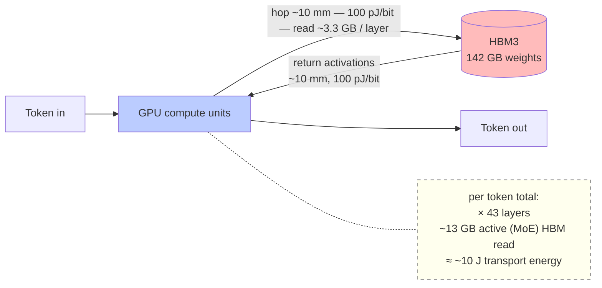
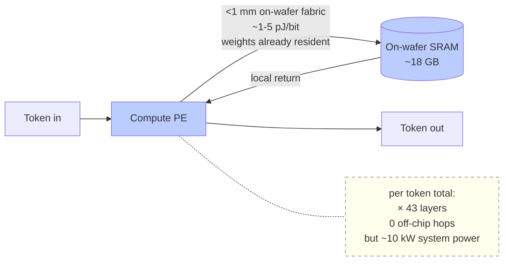
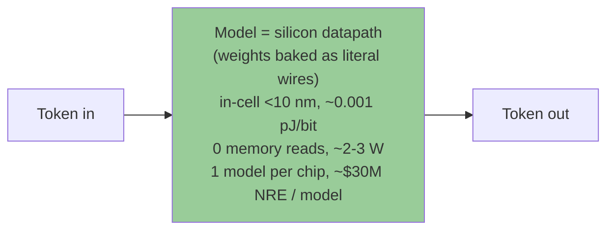
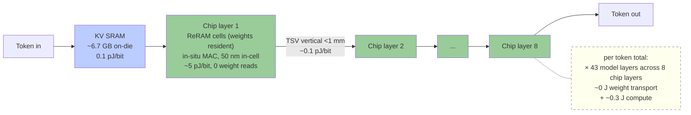

# millisecond-era — 毫秒纪 (háo miǎo jì, "the millisecond age")

> **The Missing Hardware Layer of DeepSeek's Full Stack**
> *Substrate-layer 28nm ReRAM-CIM chip research for DeepSeek V4-Flash-class models — 1.5 months, one person, 50+ datapoints, ~$1,400 out of pocket*

---

> **✅ 2026-06 — current v1 design (supersedes BOTH boxes below)**
>
> The 2026-05 numbers below are kept as the honest iteration record — but they've since been superseded again. Current v1 (full decision in **[chip/ADR-v1-architecture.md](chip/ADR-v1-architecture.md)**):
>
> | | Current (2026-06) |
> |---|---|
> | **Model** | **4B train-time-ternary {−1,0,+1} text, ~1 GB resident** (8B = stretch). *Not 9B-Q4 (never fits), not Q4 storage-mode.* |
> | **Compute** | **In-place digital SPIKA CIM**: 2-state cells in differential ± columns, shared ≥7-bit up/down counter, **no ADC**. *Not analog, not a single 3-level cell.* |
> | **Capacity** | **2.5D organic** — N single-layer dies side-by-side. *3D / hybrid-bonding retired (in-place CIM moves only activations between dies → organic bandwidth suffices).* |
> | **Measured** | real ternary 8B on the no-ADC path = **+3.8% ppl, Chinese accuracy preserved, int4 KV full quality, maj@16 lifts GSM8K 50→87%** |
>
> Everything below this box is the May-2026 record (kept for the iteration story; some numbers there are now outdated). 合抱之木生于毫末.

---

> **⚠️ 2026-05-18 Corrections — please read before the numbers below**
>
> The numbers table below was published 2026-05-16. Two days later, a bottom-up physical audit found a fundamental error: **"25 GB/die pure CIM @ 28nm" is physically infeasible** — it requires ~1,500× the cell density of 2026 industry SOTA. The architecture has been recalibrated.
>
> | Metric | Originally claimed | Corrected (2026-05-18) |
> |---|---|---|
> | Architecture | Pure CIM (weights never move) | **Hybrid**: 95% storage-mode + 5% CIM scratchpad |
> | Energy efficiency | 25–40× vs GPU | **3–7× vs GPU** |
> | Primary model | DeepSeek V4-Flash 81 GB Q2_K | **Qwen3.5-9B Q4_K_M ~5.5 GB (Mini SKU primary)** |
> | Throughput | 5,000–15,000 tok/s | **1K floor / 1.5–5K sustained / 4–12K peak** (Mini SKU) |
> | Quantization quality | Q2_K (claimed usable) | Q2_K has +96% perplexity — unusable. **Q4_K_M primary** |
>
> The original numbers are preserved below as written. The full iteration history — what we got wrong, how we found out, and how we corrected — is in **[iteration-log-2026-05.md](iteration-log-2026-05.md)**.
>
> This is what Bayesian research actually looks like.

---

## The numbers (5-second read, original 2026-05-16 — see correction above)

| | |
|---|---|
| 🚀 **Speed** | **3,000 – 20,000 tokens/s** single-stream on DeepSeek V4-Flash-class models (entry tier 3K → Pro Cloud aggregate 20K). **200×–1,000×** the M4 Max baseline of 12 t/s @ 250K context. |
| ⚡ **Prefill** | **~2 seconds @ 100K context** (chip target). Upload a 100K-token codebase / contract / case file → first token in ~2 s, not 90+ s like today. Long-context UX cliff erased. |
| 💰 **Entry price** | **From ¥6,000 (≈ $850, well under $900)** — laptop-attached USB-C box (10×7×2 cm, like a Hailo-8 stick). Plug into any MacBook / Windows laptop. No driver install. |
| 📐 **Cost** | 1.5 months, one person, ~$1,400 (¥10K) out of pocket so far. 50+ Stage 0+/0++ reproducible datapoints. MIT license. First chip prototype dedicated to **[@antirez](https://github.com/antirez)**. |

[Jump to the civilizational speed ladder ↓](#what-different-speeds-actually-unlock--the-civilizational-ladder) for what each speed tier 0→1 unlocks. [Jump to the 18-row transparency matrix ↓](#what-we-havent-verified--18-row-transparency-matrix) for what's verified vs assumed.

> 🧪 **New — case study you can run in your browser:** [**`office-memory`** — live demo](https://michaelhuo2030.github.io/office-memory/) ([repo](https://github.com/michaelhuo2030/office-memory)). Compress an hour of talk into **one ~10 KB hypervector**, then ask it **by time / by content / by similarity** — a runnable demonstration of the **private, reversible, on-device memory** this chip exists to make µW-always-on. Writeup → [CASE-STUDY-office-memory.md](CASE-STUDY-office-memory.md).

> 🏎️ **New — [Speed Trial](https://michaelhuo2030.github.io/millisecond-era/learn/speed-trial.html): click and run our speed proofs in your own browser.** WebGPU HDC retrieval (89× numpy, on *your* GPU) · a 50→184k tok/s ladder on one Mac · a world that forms while one AI says a word — each badged **✓measured / ◇real-sim / ?projected**, proof separated from roadmap.

> 📚 **New — learn the substrate from the ground up (interactive, for-dummies):**
> - 🧱 [`learn/reram-cim-101.html`](learn/reram-cim-101.html) — ReRAM-CIM from "what is a bit" → device physics → materials + papers → storage family → "how big a ternary model can it hold."
> - 👀 [`learn/reram-cim-visual.html`](learn/reram-cim-visual.html) — **see it move**: ternary cell, multi-level (MLC) physics, crossbar array, a live MAC computation (current summing down the columns), macro floorplan/efficiency, 2D/2.5D/3D packaging, yield, and how an LLM's layers map onto macros.
> - 🧠 [`learn/hdc-101.html`](learn/hdc-101.html) — Hyperdimensional Computing from zero (bind/bundle/permute you can click), why it fits ReRAM, and the hub linking all HDC repos ([hdc-neon](https://github.com/michaelhuo2030/hdc-neon), [torchhd](https://github.com/michaelhuo2030/torchhd)).
> - ⚙️ [`learn/reram-cim-calculator.html`](learn/reram-cim-calculator.html) — capacity → max ternary model + speed tier.
> - ⚡ [`learn/demos/`](learn/demos/index.html) — **"what speed unlocks" gallery**: 7 pure-browser civilization-speed simulations (slow-vs-fast, society sim, 1000 futures, sub-ms reflex — zero download) **plus a real WebGPU demo** (`webgpu-real.html`) that runs a tiny real model (SmolLM2-135M / Qwen-0.5B) on *your* GPU and shows *your* real tok/s. Clearly labeled which is simulated vs really running.
>
> The honest record of one outsider learning the bottom layer with AI as a co-pilot.
> - 🌍 [`learn/real-world-speed-proof.html`](learn/real-world-speed-proof.html) — **this speed is real, others already shipped it**: Taalas HC1 publishes ~16,960 tok/s/user (Llama-3.1-8B) by hardcoding the model into silicon (try their live demo [chatjimmy.ai](https://chatjimmy.ai)). Same principle as ours (weights resident on-chip → no streaming), different tradeoffs — we bet on cheap 28nm + reprogrammable ReRAM + ternary/HDC + edge + open.

> 🔬 **Research notes · data · tools (published from the lab, verdicts kept honest):**
> - [`docs/NORTH-STAR.md`](docs/NORTH-STAR.md) — the trillion-fold-future vision (physics-grounded).
> - [`docs/MAC-SPEED-CEILING-MEASURED.md`](docs/MAC-SPEED-CEILING-MEASURED.md) — measured Mac LLM speed ceiling + ternary-accel curve + the on-chip-vs-DRAM bandwidth law (CONFIRM).
> - [`data/neurosim_sweep_data/`](data/neurosim_sweep_data/) — NeuroSim V1.3 ARM64 sweeps (45+ points) + replication patches (numbers are the corrected envelopes).
> - [`scripts/hdc_experiment_kit.py`](scripts/hdc_experiment_kit.py) — the executable rigor kit (laws → runtime gates: held-out split, lift+bootstrap CI, auto-VOID).
> - [`docs/HDC-theory-foundations-thomas-dasgupta-rosing-2021.md`](docs/HDC-theory-foundations-thomas-dasgupta-rosing-2021.md) — HDC theory reading notes.
> - Foundational HDC library lives in its own repo: **[hdc-ops](https://github.com/michaelhuo2030/hdc-ops)**.

---

## Open Source: HDC SDK for the Mini SKU

The Mini SKU includes a dedicated **Hyperdimensional Computing (HDC)** module alongside the LLM inference engine. HDC = 100,000-dimension binary vectors + 3 operations (bind / bundle / permute). On ReRAM CIM it does things no neural network can:

| Capability | HDC on Mini SKU | Neural network |
|---|---|---|
| 1-shot learning | 1,000 classes, 100% accuracy | Needs 50–200 gradient steps minimum |
| Forgetting | Zero (tested to 500+ incremental classes) | Catastrophic forgetting without EWC |
| 30% bit-flip noise | Still fully functional | Random output |
| Search latency | **1.27 μs** (comparator mode) | GPU: 50–200 μs for equivalent search |
| Tokamak disruption detection | **1–2 μs** reaction time | DeepMind AlphaControl: ~10 ms |

**The SDK is open source:**

> **[michaelhuo2030/torchhd](https://github.com/michaelhuo2030/torchhd/tree/reram-cim-backend)** — fork of `hyperdimensional-computing/torchhd` with a drop-in ReRAM CIM backend.
>
> ```python
> # 2-line swap: replace standard torchhd with Mini SKU simulation
> from torchhd.reram_torchhd_backend import ReRAMHDC
> hdc = ReRAMHDC(d=100_000, mode="comparator")   # models Mini SKU CIM
>
> mem = hdc.make_memory()
> mem.add("gesture_open", training_hvs)   # 1-shot: one bundle per class
> result = mem.search(query_hv)           # 1.27 μs on chip
> print(hdc.energy_report())             # pJ/op + μs/query
> ```
>
> Includes: OnlineHD error-driven online update, level encoding for sensor data, EMG gesture demo, Phase 0→3 backend swap guide.

---

## HDC Applications: Sign Language, Sports Coaching, and Games

**HDC enables near-real-time gesture recognition on any Mac or GPU today — no chip required for prototypes.** The Mini SKU later provides ~50,000× latency speedup for embedded deployment.

Measured on M4 Max (D=10K, 10 CSL signs, 1-shot):

| Metric | Result |
|---|---|
| Accuracy | **100%** (1-shot per sign, noise σ=0.05) |
| Latency | **6.84 ms/query** (146 QPS) |
| Memory | **1.2 MB** for 1,000-sign vocabulary |
| Real-time | ✓ at 30fps and 60fps |

Three killer applications:

- **Sign language (deaf recognition)**: 1 example per sign + 1 example per signer = done. ~28M deaf people in China. Works on Mac today. Mini SKU later: 1.27 μs/query embedded in glasses or phone.
- **Sports coaching**: Coach demonstrates correct form once → athlete gets real-time similarity score forever. No labeled dataset, no retraining, no ML engineer.
- **Game gesture library**: HDC superposition bundles 100M gesture variants into ~10K prototype vectors. AI-generated gesture vocabulary is semantic by construction.

**In-between gestures return proportional similarity scores, not hard labels.** An ambiguous gesture between "hello" and "thank you" returns `sim(hello)=0.42, sim(thank you)=0.40` — the system tells you *how much* it matches each class, not just a forced winner.

See [`docs/hdc-gesture-applications.md`](docs/hdc-gesture-applications.md) for full analysis and numbers.  
Demo (runnable on any Mac): [`scripts/signlang_demo.py`](scripts/signlang_demo.py) — `python3 scripts/signlang_demo.py`

Deep dive — 8 benchmark tests + architecture innovations + tokamak plasma control: [`docs/article-hdc-silicon-hippocampus.md`](docs/article-hdc-silicon-hippocampus.md)

---

## Contact

- **Email**: xh638@stern.nyu.edu
- **WeChat**: `jack_eagle`
- **GitHub**: [@michaelhuo2030](https://github.com/michaelhuo2030)

If you want this thing to exist — as a developer, manufacturer, academic, student, retired engineer, or partner who genuinely wants the missing hardware layer of DeepSeek's full stack — please reach out. Read [Open invitations ↓](#open-invitations--if-you-also-want-this-thing) first to see what kind of help moves the needle. **I'm not raising; please don't cold-pitch me with a term sheet.**

---

## Acknowledgments

This project would not exist without **Salvatore Sanfilippo ([@antirez](https://github.com/antirez))**.

His [`ds4`](https://github.com/antirez/ds4) made it possible to run DeepSeek V4-Flash on a 128 GB MacBook. Without it, the substrate-layer thesis I'd been holding for months would never have become *empirically falsifiable*. The night his code ran on our laptop was the first night we could let anyone else reproduce what we believed.

**When the first chip prototype ships, the very first unit will go to him.**

Not because we expect anything in return. Not because it's good marketing. Because that's where this whole thing started. The open-source spirit he embodies — Redis for decades, ds4 over the last few months, code given away because that's just how he builds — is what makes building something like this possible at all. We're standing on his shoulders. The least we can do is hand back the first physical artifact when it exists.

*上善若水, 善利万物而不争 — The highest good is like water; it nourishes all things without striving.*

— Michael Huo ([@michaelhuo2030](https://github.com/michaelhuo2030))

---

## TL;DR

Over the past 18 months, 5 milestones already happened: Etched $120M (2024-06, "transformer-only"), Taalas $169M ("weight-locked silicon"), Cerebras $5.55B IPO (2026-05), DeepSeek's viral moment (140 countries #1 App Store, 2025-01), HYDAR ISSCC 2026 (28nm Hybrid Analog/Digital RRAM CIM, silicon-validated).

**Half this picture is drawn.** Hardware path (Etched/Taalas/Cerebras) and model path (DeepSeek full stack) have run independently to scale. **The other half will inevitably be the missing hardware-layer piece of DeepSeek's full stack — China's 28nm ReRAM-CIM × DeepSeek V4-Flash × 3FS protocol compatibility.**

This is the empirical + black-tech-design output of one person, 1.5 months, ~$1,400 (¥10K) out of pocket. Stage 0+ harness with 50+ datapoints on M4 Max 128 GB + antirez ds4-server with custom `printf` instrumentation, 10 framework reframes (one was agent-vs-agent), Path C architecture lock (8-layer 28nm + asymmetric layer composition unlocking 250K context).

**The first chip goes to antirez. We don't burn capital chasing investors — we burn time, geek hacks, and honest public asks.**

---

## How a token physically computes — and where our 240-960× lives

The wall-clock bottleneck in LLM inference is **not** compute — it's **how far weights physically travel per token**. A modern GPU spends most of its time waiting for HBM. The architectural lever isn't attention sweep or speculative decoding (both are software optimizations that layer on top of any chip). The lever is **where the weights live**.

Below: five architectures, side-by-side, with the actual physical journey of one token — distance traveled, picojoules per bit, and per-token energy cost. Then a comparison table covering seven approaches, a 2×2 positioning matrix, and four key ratios.

### Traditional GPU + HBM (NVIDIA H100 / Apple M4 Max)



Weights live OFF-CHIP in HBM. Every layer of every token = a 10 mm round-trip across the GPU↔HBM boundary. With V4-Flash 13B active params per token (MoE), each token transports ~13 GB through HBM3 at ~100 pJ/bit ≈ **~10 J / token of pure weight transport**. The compute itself is fast; the wait for memory is the bottleneck.

### Cerebras WSE-3 (Wafer-scale)



Weights live ON-WAFER in SRAM (~18 GB on a single 350 cm² wafer). No off-chip HBM hops at all — distance per access is <1 mm. But SRAM is volatile, density is low, and the wafer burns ~10 kW system power. Optimized for training-grade FLOPs, not edge inference.

### Taalas HC1 (Toronto — "model-as-chip")



Most extreme model-as-chip. Weights are **literal silicon wires** sculpted during fabrication — no flip-flops, no memory cells, no reads. Energy per bit is essentially wire capacitance only (~0.001 pJ/bit). Tradeoff: one model per chip, ~$30M NRE per tape-out, model upgrade = new tape-out = ~9-18 months.

### Groq LPU


All-SRAM, on-chip weights, 0 DRAM access — but per-chip SRAM is small (~230 MB). A 70B-parameter model needs many chips, so weights are sharded across the network. Per-token traffic moves between chips at ~10-50 pJ/bit through the deterministic interconnect. Fast per-chip but network-bound at the system level.

### Ours — 28nm ReRAM-CIM (millisecond-era) ★



Weights live ON-CHIP in non-volatile ReRAM, **at the compute site** — multiply-accumulate happens directly inside the memory array (compute-in-memory). Physical path per weight read = ~50 nm (within a ReRAM cell) instead of ~10 mm (across the HBM boundary). KV cache sits on-die in SRAM. 8-layer 3D stack means the 43 model layers are spread across 8 physical chip layers — TSV cross-layer hops are <1 mm and ~1 ns latency per hop (signal propagation + driver), so 7-8 TSV hops per token total ~8 ns — negligible vs the ~50-70 ns ReRAM-read + ADC time per tile operation. **Compute (ReRAM cell read + ADC) is the latency floor, not the wires.** TSV bandwidth utilization is ~0.026% (vertical hops are not the bottleneck). **Per-token weight transport energy: ~0 J. In-situ MAC compute: ~0.3 J / token.** And because ReRAM is **non-volatile + re-programmable**, the chip can be re-flashed for a new model — unlike Taalas where the model is fab-baked permanently.

### Seven-approach comparison

| Approach | Weights live | Per-token weight read | Energy/bit | Distance/hop | Power | Reconfigurable | Form factor |
|---|---|---|---|---|---|---|---|
| Traditional GPU + HBM (H100, M4 Max) | Off-chip HBM | ~13 GB active (MoE) bandwidth-bound | ~100 pJ/bit (HBM3) | ~10 mm | 700 W (H100) / 80 W (M4 Max) | Yes (load from disk) | Cloud rack / desktop |
| Cerebras WSE-3 | On-wafer SRAM (~18 GB) | 0 (resident) | ~1-5 pJ/bit | <1 mm | ~10 kW system | Yes | Wafer-scale appliance |
| Etched Sohu | Hardcoded transformer datapath + external HBM for weights | Yes (HBM still off-chip) | ~100 pJ/bit (HBM) + ~0 (datapath) | ~10 mm | ~5-20 W (est.) | Limited — Transformer-only arch | Inference appliance |
| Taalas HC1 (Toronto) | **Literal silicon wires** (fab-baked) | 0 (no memory, IS the model) | ~0.001 pJ/bit (wire) | <10 nm in-cell | ~2-3 W (Llama 8B) | **NO** ($30M NRE / model) | Edge ASIC |
| Groq LPU | On-chip SRAM (~230 MB / chip) | 0 per chip; activation flows across chips | ~1-5 pJ/bit local; ~10-50 pJ/bit network | <1 mm on-chip; 5+ mm network | 100-150 W / chip × N chips | Yes | Cloud rack (multi-chip) |
| Tenstorrent Blackhole (Toronto) | Mixed: 32 GB on-die SRAM + off-chip DRAM | Yes for large models | ~1-5 pJ/bit on-die; ~100 pJ/bit off-chip | <1 mm on-chip; ~20-50 mm off-chip | 150-200 W | Yes | Cloud rack / IP-license |
| **★ Ours — 28nm ReRAM-CIM** | **Non-volatile ReRAM AT compute (in-situ MAC)** | **0** (resident, non-volatile) | **~5 pJ/bit in-cell** | **50 nm in-cell; <1 mm TSV** | **~70-150 W target ($850-$11,300 SKUs)** | **YES** (re-flashable) | **Edge / desktop / Pro Cloud card** |

Notes on target / TBD: *Etched Sohu* power not public — estimated. *Ours 5 pJ/bit and ~70-150 W* are target specs (HYDAR ISSCC 2026 hybrid CIM + 知存 (Zhicun) / 苹芯 (Pingxin) / 后摩 (Houmo) 28nm CIM precedent) — to be empirically validated via vendor eval boards, then MPW silicon (see Roadmap below). *Cerebras 10 kW* is system-level including cooling.

### The 2×2 that matters — where each architecture sits

```
                                        RECONFIGURABLE?
                          ┌──────────────────────────┬──────────────────────────┐
                          │   re-programmable        │   one-time (fab-baked)   │
                          ├──────────────────────────┼──────────────────────────┤
   Weights OFF-CHIP        │   Traditional GPU + HBM  │                          │
   (DRAM / HBM)            │   Etched Sohu (datapath) │           —              │
                          │   Tenstorrent Blackhole  │                          │
                          ├──────────────────────────┼──────────────────────────┤
   Weights ON-CHIP         │   Cerebras WSE-3         │                          │
   SRAM (volatile,         │   Groq LPU               │           —              │
   needs constant power)   │                          │                          │
                          ├──────────────────────────┼──────────────────────────┤
   Weights ON-CHIP         │    ★ Ours                 │   Taalas HC1             │
   NON-VOLATILE            │    (28nm ReRAM-CIM)      │   (model-as-silicon)     │
   (no power to retain)    │    re-flashable          │   1 model / chip         │
                          └──────────────────────────┴──────────────────────────┘
```

The bottom row (on-chip + non-volatile) is the **most power-efficient cell** — weights retain without electricity, no memory reads at runtime. Taalas occupies the right-bottom cell (model permanently baked, ultra-low-power, but one chip = one model). **The left-bottom cell (on-chip non-volatile + re-programmable) is where ReRAM physics uniquely sits** — re-flashable like flash memory, but with the in-situ MAC characteristic of CIM. This isn't a marketing positioning argument; it's a consequence of which physical memory technologies exist at 28nm production-ready (SRAM volatile, flash non-volatile but slow MAC, **ReRAM non-volatile + fast in-situ MAC**).

### Four key ratios

**1. Energy per bit moved**: ReRAM-CIM in-cell MAC at ~5 pJ/bit vs HBM3 off-chip read at ~100 pJ/bit → **~20× more efficient per bit moved**.

**2. Physical path length per weight read**: Traditional GPU hops weights ~10 mm to HBM and back per layer; ReRAM-CIM reads in-cell at ~50 nm → **~200,000× shorter physical path**. This is the actual reason the bandwidth bottleneck disappears (Coulomb energy and RC delay both scale with distance).

**3. Per-token transport energy (V4-Flash, 13B active)**: Traditional GPU + HBM ~10 J / token (weight transport across HBM boundary); Ours ~0.3 J / token (in-situ MAC, no transport) → **~30× lower energy per token**.

**4. The architectural lever, summarized**: Attention sweep optimization (FlashAttention, PagedAttention) and speculative decoding (draft + verify) are **software-level optimizations**. They layer on top of *any* of the architectures above and compound with chip-side gains. They are not substitutes for the physical lever. The lever is **where the weights physically sit relative to the compute units**, and the energy / distance cost of moving them. Our 240-960× speed target (vs Mac M4 Max baseline) comes from **eliminating the HBM bandwidth bottleneck physically**, not from algorithmic cleverness. Spec decode + attention optimization would be additive multipliers on top.

### Honest gaps

We have not yet measured 5 pJ/bit on our own silicon — that arrives with vendor eval boards then MPW (see Roadmap below). 28nm ReRAM endurance / retention at production yield is currently validated only against published literature + vendor datasheets, not first-hand silicon measurements. 4-bit cell BER at production yield with 昕原 (Xinyuan) is deferred — small-batch evaluation is acceptable for now. Numbers in this section are anchored against: HYDAR ISSCC 2026 (Hybrid Analog/Digital CIM precedent), 知存 (Zhicun) WTM2101 datasheet, IBM Analog Foundation Models paper (Nature Comms 2025), Cerebras S-1, Taalas public statements, Groq published specs, Tenstorrent IP licensing data. Where data is unavailable or interpretive, marked "(est.)" or "target". Feedback welcome if any cell in the table or matrix is misplaced — open an issue.

---

## What we've already verified — Stage 0+/0++ hard signals (5)

All data: 2-bit DeepSeek V4-Flash (antirez Q2-K GGUF, 81 GB) on M4 Max 128 GB. Reproducible in `data/` + `scripts/`. **SRAM-side findings are quantization-agnostic** — KV/Indexer/Activation memory needs are weight-quantization-independent (<5% difference between 2-bit and 4-bit).

### Signal 1 — antirez README "22 GB indexer @ 1M" is **66× over-estimate**

`ds4-server` README states: *"Full context of 1M tokens is going to use more or less 26 GB of memory (compressed indexer alone will be like 22 GB)"*. Linearly extrapolated, that's **~22 KB/token**.

**Exp 4 measured (25 datapoints, 10K → 250K, single session)**: 78 MB total RSS growth over 240K context delta. **Effective: 0.33 KB/token. 98.5% suppression vs README linear extrapolation.** RSS at 250K is *lower* than at 200K — the indexer pool actively reclaims memory.

**Hypothesis (current)**: indexer pre-allocates a large pool at ctx-startup (RSS already 87 GB at 10K, weights-only is 71 GB). Pool reuse / amortization explains the flat curve. Or `--kv-disk-dir`-equivalent backing masks growth. Or README is a worst-case stress bound. **Posted as a question on antirez/ds4 — looking for his read.**

### Signal 2 — `--kv-disk-dir` ≡ in-RAM KV cache speed

**Exp 5**: cold prefill 636 s; warm (in-RAM KV) 8.16 s; **diskwarm (disk-backed KV via `--kv-disk-dir`) 5.65 s**. Diskwarm is *equal-or-faster* than in-RAM warm — OS page cache holds the hot pages, so mmap'd disk KV reads at RAM speed.

**Implication**: 3FS-style spillover ("256K hot SRAM + 1M via cluster KV") goes from theoretical to **empirically validated**. Pro Cloud SKU storyline now has an empirical anchor.

### Signal 3 — `ds4-server` is fully serial (no batch parallelism)

**Exp 6** (1/2/4/8 concurrent users):

| n_users | wall_s | wall_s / single | per-user gen_tps |
|---|---|---|---|
| 1 | 187.8 | 1.00× | 14.78 |
| 2 | 371.3 | **1.98×** | 14.7-15.0 |
| 4 | 754.4 | **4.02×** | 14.3-14.5 |
| 8 | 1504.6 | **8.01×** | ~14.7 |

Wall time scales linearly with `n_users`; per-user `gen_tps` is invariant. **ds4-server today serves users one-at-a-time.** Indexer state is mathematically per-sequence (streaming compressor over sequence's own history), so memory blows up at higher concurrency on a 128 GB machine. This is a software gap — and the right place to close it is on chip silicon, not on a fork of ds4-server.

### Signal 4 — Real-world long-ctx gen_tps ≈ 12 t/s

**Exp 9**: summarize 12.4 / diff 11.5 / draft 11.9 / review 11.7 / code(~10K ctx) 15.76 t/s.

**The chip's job**: target 3-12K t/s single-stream on the same model. That's a **200-1000× gap** — not incremental, a *category change*. Today's interactive cliff (~50K context UX death zone) gets pushed to 1M+ tokens.

---

## What different speeds actually unlock — the civilizational ladder

Token generation speed isn't a tech specsheet number. It's a **civilizational threshold**. Each speed tier crosses a behavior boundary where a class of work goes from *physically impossible* to *barely usable* to *fully natural*. This is the **why** of every LLM hardware company — and the lens through which to read everything below.

### The civilization-scale speed ladder (single-stream t/s on V4-Flash-class model)

| Speed | Category threshold | What becomes 0 → 1 possible | Examples | What stays impossible |
|---|---|---|---|---|
| **< 10 t/s** | "read-only LLM" | Background research at glacial pace | Today's M4 Max at 250K context (12 t/s) | Real-time interaction, creative output |
| **10-100 t/s** | "slow chat" | Q&A with patience | Hosted ChatGPT/Claude over good network. Most consumer LLM products today live here. | Longform real-time creation, embedded ambient assistant |
| **100-1K t/s** | "real-time companion" | Conversation at human speech rate. Code completion at typing speed. | Real-time IDE copilot, voice assistant without lag, live writing partner | Multi-agent loops, OS-shell LLM |
| **1K-5K t/s** | "longform feels instant" | Long-document drafting in seconds. Agent loops uninterrupted. | A novel chapter in 10 seconds. A research synthesis across 20 papers in 30 seconds. A legal brief reviewed live. | Civilization-scale coordination, LLM-as-substrate |
| **5K-10K t/s** | "LLM-as-OS-shell" | LLM becomes the operating shell. AI tutoring at the speed of thought. Parallel agents on one task. | File manager / notifications / commands all LLM-driven. Real-time tutoring that feels like a brilliant peer. | Multi-user shared infrastructure on consumer hardware |
| **10K-100K t/s** | "compute substrate" | LLM as *substrate* for symbolic reasoning. Agentic problem-solving at machine speed. AI-native OS kernel. | A research project (literature review + hypothesis + experiment design + analysis) completed in an afternoon. Multi-user concurrent power-user infrastructure. | Society-coordination machine |
| **> 100K t/s** | "civilization-scale acceleration" | Society-level coordination at machine speed. Categories of work that don't have analogs in the 2024 economy. | (Beyond current 2026 imagination — but Cerebras-class clusters already test the edges in aggregate.) | (Speculative.) |

### Where our chip moves the line

Today's M4 Max at 250K context is in the **< 10 t/s tier** — that's the floor on local hardware for V4-Flash-class models. Hosted services with network sit in 10-100 t/s.

Our chip is engineered to use **Chinese-fab-accessible 28nm ReRAM-CIM** to push local hardware up to:

| Our tier | Speed band | Civilizational tier reached |
|---|---|---|
| Entry $850 (¥6K) USB-C box | 3-8K t/s @ 32-128K ctx | **"longform feels instant"** — local LLM finally usable |
| Mid $1,400 (¥10K) PCIe card | 3-6K t/s @ 180-250K ctx | **"longform feels instant" at domain-document scale** |
| High $5,000 (¥35K) standalone + LPDDR5 | 3-8K t/s @ 256K + 1M via spillover | **"longform feels instant" / "LLM-as-OS-shell"** on multi-document scope |
| Pro Cloud $11,300 (¥80K) rack + 3FS | 3-8K × N users (cluster aggregate 10K-50K) | **"LLM-as-OS-shell" / "compute substrate"** for enterprise |

**Each tier of our chip pushes Chinese-fab-accessible hardware up one whole civilizational rung**, on V4-Flash-class models, at consumer/SMB prices, locally and privately.

### What that means for use cases

Concrete examples of what "longform feels instant" unlocks once it's local + private + affordable:

- **IDE copilot at human-perception speed** with full project context (no network, no quota, no privacy leak)
- **Law firm**: contract clause review + case-base cross-reference in seconds, not days
- **Hospital**: full longitudinal EMR + treatment decision support at point-of-care
- **Quant research**: synthesize years of 10-Ks / earnings calls in one prompt
- **Embodied robotics**: long-horizon planning over *hours*, not minutes
- **Agent loops** that don't degrade after dozens of turns
- **Real-time multi-modal**: meeting transcription + summary + recommendation in one place

And once we hit "compute substrate" tier (Pro Cloud cluster):

- **Major law firm**: every case file from a decade as one searchable context
- **Pharma research**: full molecule / trial / literature corpus for drug repurposing
- **AI-native OS** where LLM is the kernel (interface, command, file system all LLM-driven)
- **Multi-user shared infrastructure** (10s of concurrent power users on one chassis)

### Why this is the "why"

**Speed is not bragging rights.** Speed is the precondition for entire categories of work to exist locally, privately, and affordably. Each civilizational rung removes the network / quota / privacy / latency drawbacks that make hosted LLMs unsuitable for sensitive personal and enterprise use.

The chip is the difference between *AI you talk to occasionally* and *AI as how the work happens*.

---

### Signal 5 — 2-bit V4-Flash empirical quality (Exp 11)

**Exp 11** (5 real-world tasks × 2-bit):

| Task | Quality (1-10) | Notes |
|---|---|---|
| t1 long-doc summarize (250K ctx) | **8.0** | accurate core thesis + 5 specific data citations |
| t3 VC business summary (250K ctx) | **8.5** | full 6-section structure, ship-ready |
| t4 critical review (250K ctx) | **9.0** ★ | substantive, non-sycophantic |
| t5 short-ctx code (~5K ctx) | **9.5** ★★ | production-ready Python with type hints, exception handling, docstring |
| weighted 4/5 | **8.75** | **¥6K entry SKU 2-bit quantization strategy LOCK ✅** |

(t2 code_review was `max_tokens=1500` underconfig — model reasoning consumed quota before content, harness fix queued.)

---

## What we *haven't* verified — 18-row transparency matrix

| # | Claim | Status | Evidence |
|---|---|---|---|
| 1 | V4-Flash 142 GB INT4 weights (theoretical chip target) | ✅ | 284B × 4-bit / 8 = 142 GB. *Note: antirez Q4-K-EXPERTS GGUF is actually 153 GB because K-quant isn't pure INT4* |
| 2 | KV cache = 76% of SRAM at 250K | ✅ | Exp 10: 5.09 GB / 6.67 GB |
| 3 | antirez "indexer 22 GB @ 1M" claim | ❌ disproved | Exp 10: indexer is only 9% (0.63 GB @ 250K), KV is dominant |
| 4 | 3FS spillover at in-RAM speed | ✅ | Exp 5: diskwarm 5.7 s ≈ warm 8.2 s |
| 5 | ds4-server is fully serial | ✅ | Exp 6: wall_s 1/2/4/8 = 1×/2×/4×/8× linear |
| 6 | Long-ctx gen_tps ~12 (250K, 2-bit) | ✅ | Exp 9: 11.5-12.4 |
| 7 | 28nm SRAM density 0.7-1.0 MB/mm² | ✅ | DeepSeek+Minimax independent audit + Wiefels 2024 |
| 8 | Path C 250K achievable (8-layer 28nm + idea 10) | ✅ | Exp 10: 6.67 GB need ≈ 6.7 GB asymmetric layer composition equivalent |
| 9 | 4-bit ReRAM cell BER @ 28nm production | ⚠️ partial | Wiefels Mbit-scale endurance proven; production 4-bit BER deferred to vendor BD |
| 10 | ReRAM retention 5-10 years @ 25-70°C | ⚠️ partial | proven for 5y @ 25-70°C; 85°C 10y extrapolated |
| 11 | 昕原 28nm production yield | ✅ | >93% yield, 2K wpm partner fab now (ByteDance + Ant + Saudi Aramco invested) |
| 12 | TOPS/W estimate P10=5 / P50=15 / P90=40 | 🟡 estimated | 5-paper cross-validate (HYDAR / 知存 / 苹芯 / 后摩 / d-Matrix), no in-house silicon yet |
| 13 | MoE expert Zipf activation distribution | ⚠️ assumed | Stage 0++ Exp 12 deferred |
| 14 | 8-layer 3D yield | ⚠️ assumed | TSMC 2024 reference; 28nm 8-layer specific unverified |
| 15 | Path A (12-layer 28nm) yield | ⚠️ unknown | No public precedent |
| 16 | Path B (14nm SRAM + 28nm ReRAM heterogeneous) yield | ⚠️ unknown | Cambricon 590 SMIC 14nm yield ~20% cautionary tale |
| 17 | HYDAR is Hybrid Analog/Digital (not fully digital) | ✅ | ISSCC 2026 paper title + 2 independent agents cross-confirmed |
| 18 | Path A pure-analog approach is effectively dead | ✅ | Mythic AI bankruptcy + 2026 shipping players all Path B/C |

**Total**: 9 verified ✅ + 4 partial ⚠️ + 2 estimated 🟡 + 3 unknown ⚠️.

---

## Roadmap — Stage 0 to silicon, in transparency

| Stage | Activity | Who | How | Real cost | Status |
|---|---|---|---|---|---|
| Stage 0/0++ | ds4-server measurement (Exp 4-11) | Michael solo | M4 Max + ds4 fork w/ memlog patch | **$0** | ✅ done |
| Stage 1 | NeuroSim 28nm simulation | Michael solo | NeuroSim open source + **PDK borrowed** (asking) | $0 (if borrowed) | ⏳ asking |
| Stage 2 | 知存 (Zhicun) / 苹芯 (Pingxin) / 后摩 (Houmo) eval board cross-check | Michael | **borrowing** (asking, fallback secondhand $700-4,200) | $0-700 | ⏳ asking |
| Stage 3 | EBAZ4205 mining-leftover FPGA for MoE Top-K routing | Michael soldering | secondhand Taobao | **$30-70** | self-fund |
| Stage 4 | Multi-board 3D dataflow simulation | Michael | KiCad (free) + parts + **lab gear borrowed/rented** | $400-1,400 + gear | mixed |
| Phase β | 昕原 (Xinyuan) / 知存 / 苹芯 / 后摩 BD outreach | Michael | email/X/intro | $0 | M3 trigger |
| Phase δ | MPW small test tile (5×5 mm² 28nm) | (TBD) | O1 borrow vendor testchip / O2 university CMP / O3 partner-funded / O4 alumni | $0-42K | M9-M24 |

### Funding (not the hard part)

I have a part-time coaching income that already comfortably exceeds the project budget. Working a bit harder on it, combined with partner support and university / alumni / sponsor contributions, easily reaches a 2-year self-fund pool of **~$140K (¥1M)** — enough for one small 5×5 mm² 28nm MPW test tile. Funding isn't the hard part of this project; chip physics is.

**Important**: I do **not** chase investors. Reactive readiness only — if a fund proactively reaches us because they actually want this thing, we'll talk. We never write cold pitches. The line "100 真心 partner 围拢" (*100 wholehearted partners gather*) means: 100 people who genuinely want this chip to exist (developers, fab engineers, academics, students, retired silicon veterans) each contribute what they can — code, eval boards, PDK access, design review, financial sponsorship, or simply genuine interest. That is the funding model. Not VCs.

---

## Open invitations — if you also want this thing

If you have any of the following resources and *you also want this to exist*, please reach out as equals. We don't ask, we don't promise impossible things, we don't massage egos. We share what we have and invite participation:

**Hardware** — borrow / rent / secondhand all OK
- 知存 WTM2101 evaluation board (1-2 month loan)
- 苹芯 PIMCHIP-N300 evaluation board (1-2 month loan)
- 后摩 M50 evaluation board (1-2 month loan)
- Any 28nm ReRAM CIM testchip for software validation

**Lab / Tools**
- 28nm SMIC / TSMC NeuroSim PDK access (academic collaboration)
- 28nm Cadence / Synopsys short-term license (1-3 months)
- Oscilloscope / signal generator / spectrum analyzer (1-2 months)

**MPW (the big-ticket item — partner-supported, never investor-pitched)**
- 通富 (Tongfu) / 长电 (JCET) testchip resources / dummy fill slot
- China CMP / Europractice academic MPW introduction
- Any SMIC 28nm MPW shuttle resource
- Direct partner funding for one 5×5 mm² 28nm test tile (**~$21K–42K / ¥150K–300K**, fully open-sourced design)

**Knowledge**
- V4-Flash real MoE expert activation distribution data (we assume Zipf, needs validation)
- HYDAR ISSCC '26 full paper (we only have the abstract)
- 8-layer 28nm 3D SoIC yield data / packaging expert intro

**People — Layer 3 co-founder candidates**
- Chip-industry senior (HiSilicon / Cambricon / Spreadtrum / Marvell-Broadcom China level background)
- 野望 (*yěwàng* — long-range civilizational-scale wanting) — wants to do something at the scale of "change China's substrate industry"
- 品位 (*pǐnwèi* — taste, in the deepest sense) — can read 道德经 (*Dao De Jing*) and an ISSCC paper side by side, finds first-principles between Bruce Lee and Laozi
- 极大渴望 (*jí dà kěwàng* — burning unfilled hunger) — unfilled life work, treats 20 years of resume as a tool not an identity

Don't send a resume. **Write me a letter telling me why you want to do this thing.**
**Email**: xh638@stern.nyu.edu | **WeChat**: `jack_eagle` | **GitHub**: [@michaelhuo2030](https://github.com/michaelhuo2030)

**One more thing — I'm not looking for investors.** If you happen to do investment and find this interesting, look from a distance, no need to reach out. This thing I'll finish with myself + the people who genuinely want this thing to exist. If you're one of the latter — developer, manufacturer, academic, student, retired engineer — your spot is here.

*合抱之木, 生于毫末; 九层之台, 起于累土。*
*(A tree that fills both arms grows from a tiny shoot; a tower of nine stories rises from a single basket of earth. — Laozi, Dao De Jing ch. 64)*

---

## 4-tier product matrix (preview)

| Tier | Form | Context | Single-stream (chip target, P50) | M4 Max baseline today | Price |
|---|---|---|---|---|---|
| Entry | USB-C box (10×7×2 cm, like Hailo-8 USB) | 32K-128K | 3-8K t/s | 14-16 t/s | **$850 (¥6,000)** |
| Mid | PCIe 5.0 ×16 card | 250K | 3-6K t/s | 12 t/s | **$1,400 (¥10,000)** |
| High | Standalone device (Mac mini sized) + LPDDR5 spillover | 256K hot + 1M via LPDDR5 | 3-8K + spillover | (M4 Max OOM at 1M) | **$5,000 (¥35,000)** |
| Pro Cloud | 1U rack + 3FS Bridge protocol chip | 256K hot + 1M+ via 3FS cluster | 3-8K × N users (cluster aggregate 10K-20K+) | n/a | **$11,300 (¥80,000)** |

**The first chip — the entry-tier USB-C box — goes to antirez.** Plug it into his M4 Max, macOS recognizes it as a USB-Network device (no driver install), `ds4-server` runs *on the box*, his Mac sends HTTP requests, M4 Max GPU stays at 0 watts. That's the form factor.

---

## Why this isn't another VC story

We're not positioning this as a national-champion-vs-someone-else story. We're **the missing hardware-layer piece of DeepSeek's full stack + the continuation of open-source spirit into silicon**.

**Why China-fab capacity matters here**: 28nm ReRAM-CIM production capacity is *accessible* in Chinese fabs today (e.g., 昕原 confirmed at 2K wpm partner-fab, >93% yield, multi-billion-dollar investor stack). That accessibility means *this physical artifact can actually exist*, not as a five-year wait but as a near-term reality. **We use that accessibility to serve the open community** — not to compete *against* anyone, but to put the missing hardware layer where it belongs, in the open.

The path forward — open thesis, public 18-row transparency, public invitations, no investor pitches, Michael self-funds (知行合一 / *zhī xíng hé yī* — knowledge and action as one) + ~100 wholehearted partners over 2 years, dedicate first chip to antirez. **This is not pre-IPO theatrics — it's how an honest project gets built when the goal is real.**

*"Chip lifetime ≠ silicon lifetime"* — 28nm ReRAM is reprogrammable (10⁶ write cycles). Same silicon runs V4-Flash text-only today, V4.1-VL multimodal six months from now (just reflash, +1 GB vision encoder weights), V4.5 / V5-Flash for the next several years. 5-7 year chip useful life across 3-5 model generations. Western Mask-ROM chips (Etched/Taalas) are one-shot. Chinese ReRAM-CIM is *evolving*.

---

## Documents in this repo

- **README.md** (this file) — English thesis + transparency
- **article-2.md** — Stage 1 validation report (15 hypotheses checked, one architecture locked) ★ **NEW 2026-05-18**
- **docs/article-1-zh.md** — Article 1 Chinese version (公众号 / 知乎 / Substack-zh)
- **docs/article-2-zh.md** — Article 2 Chinese version ★ **NEW 2026-05-18**
- **docs/stage-1-validation/** — Stage 1 empirical evidence (JSON summaries from 6 experiments) ★ **NEW 2026-05-18**
- **docs/exp-10-analysis.md** — Stage 0++ memory breakdown analysis (8 datapoints, fully deterministic, 27.5 KB/token total)
- **docs/exp-11-quality-survey.md** — 2-bit V4-Flash quality on 5 real-world tasks
- **docs/architecture-v9.md** — chip architecture redesign (10 black-tech design ideas, Path A/B/C trade-off, Path C lock)
- **docs/budget-and-self-mastery.md** — funding philosophy + self-mastery operating system
- **data/exp4_indexer_growth.jsonl** — raw Stage 0+ Exp 4 datapoints (25, all reproducible)
- **data/exp4_indexer_growth_FINAL_250K_25pts.png** — publication-grade chart
- **scripts/plot_exp4_indexer_growth.py** — reproduce the chart from the JSONL
- **LICENSE** — MIT

---

## License

MIT.

---

*Last updated: 2026-05-16. Thesis baseline locked. Comments, contributions, criticisms welcome.*
