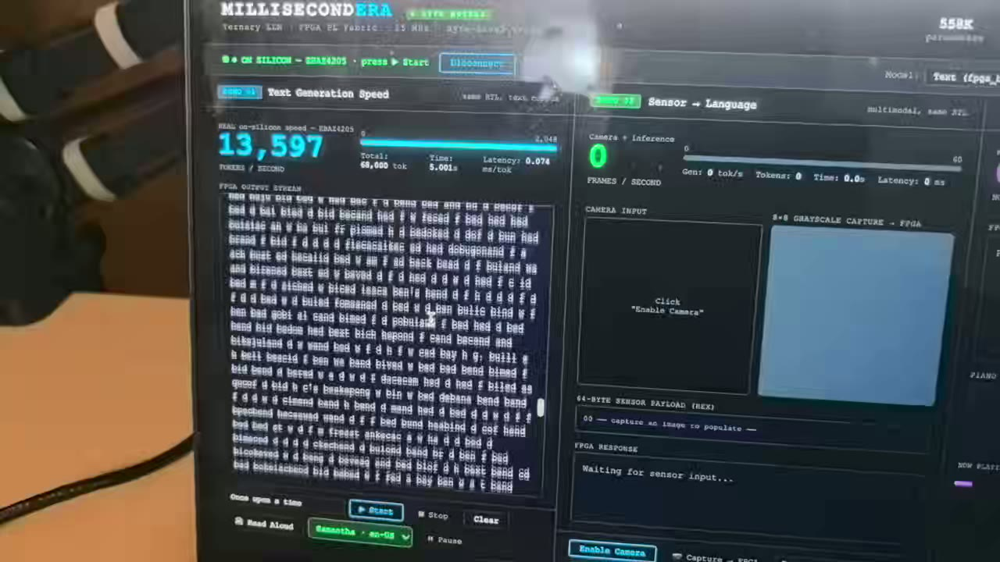
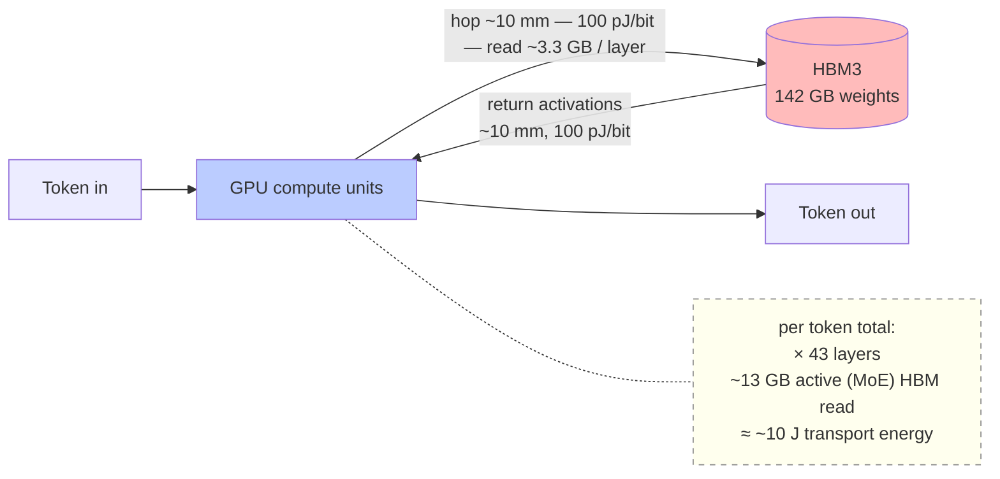
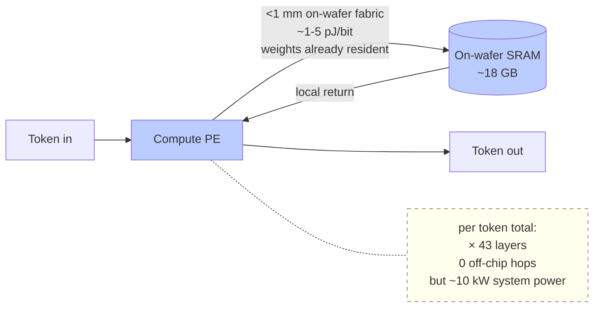
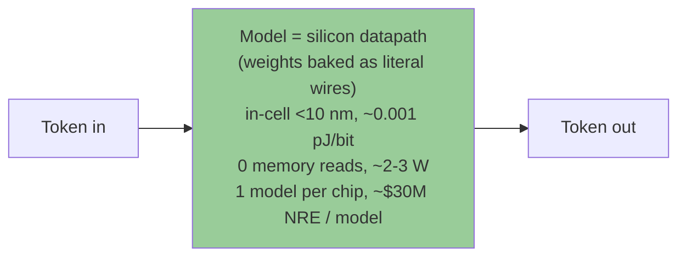
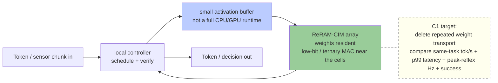

# millisecond-era — 毫秒纪 (háo miǎo jì, "the millisecond age")

> **Resident-weight ReRAM-CIM research for the millisecond age**
> *From a tiny real-silicon ternary FPGA proof to a narrow C1 edge substrate: 0.1B / 0.3B / 1B / bounded 3B first; DeepSeek-class and 100B-class systems remain C2/C3 frontier research.*

## 🔥 New — measured on real silicon: a ternary LLM generating text on a ¥205 RMB (~$29) FPGA at **~13,671 tok/s**

<video src="https://github.com/michaelhuo2030/millisecond-era/raw/main/assets/demo-ternary-llm.mp4" poster="https://github.com/michaelhuo2030/millisecond-era/raw/main/assets/demo-ternary-llm-poster.jpg" controls muted width="720"></video>

[](https://michaelhuo2030.github.io/millisecond-era/#breakthrough)

▶ **[Play it inline on the site](https://michaelhuo2030.github.io/millisecond-era/#breakthrough)** · or [download the clip](https://github.com/michaelhuo2030/millisecond-era/raw/main/assets/demo-ternary-llm.mp4) *(40 s)*

**What's running in the video — measured on real FPGA silicon, not a projection:**

- **Throughput:** **~13,671 tokens/second** on the chip — verified **three independent ways** (the chip's own token counter vs the board's wall clock over 0.5 / 1.0 / 2.0 s, all ~13,676) and matching theory (50 MHz ÷ 3,656 cycles/token = 13,675). ~68,000 tokens streamed in ~5 s, 99.95% contiguous.
- **Hardware:** **EBAZ4205** — a salvaged Bitcoin-miner board (Zynq xc7z010), **~¥205 RMB (≈ $29)**.
- **Weights:** ternary **{−1, 0, +1}** — a multiply-free datapath.
- **On-chip model:** a *tiny* proof-of-concept — **~5K ternary params, D=16, 2 layers, 32-token vocab, 8-token context**. *(The fluent paragraphs in the demo's "simulation" panel are a larger **558K software** model with bit-identical math — clearly labeled, **not** the chip.)*
- **First** time our ternary RTL runs the **full autoregressive generation loop on real hardware** (before this: synthesis + co-simulation + register readback only).
- **Honest boundary:** a tiny PoC → the text is fragmentary **by design**; the headline is **speed + real-silicon + ternary**, not language quality. It runs on an **FPGA**, not the final ReRAM-CIM ASIC (not taped out).

---

### 🎮 想直接上手玩 / Just want to play?

**👉 打开可玩首页 / Open the playable home → https://michaelhuo2030.github.io/millisecond-era/**

> 文中所有 demo 链接都已指向**线上可玩页面**（点开就在你浏览器里直接跑，零下载、零联网）。
> ⚠️ 注意：在 GitHub 仓库页面里直接点 `.html` 文件，只会看到一堆源代码 —— **要玩，请走上面这个网址。**

---

## 📊 2026-07-07 — C1 cleanroom update: the first public SKU boundary

The latest cleanroom pass narrowed the project from "build a giant AI chip" to a first product family: **C1**, a resident-weight, low-bit inference accelerator with a local controller. Full public brief: **[`chip/C1-FIRST-SKU-PUBLIC-BRIEF-2026-07.md`](chip/C1-FIRST-SKU-PUBLIC-BRIEF-2026-07.md)**.

**What changed:** the sales comparison is no longer a TOPS contest. The native comparison is **same-task tok/s, p50/p99 latency, peak-reflex Hz, closed-loop success, and local/private deployment**. TOPS/TFLOPS are only footnotes because incumbent vendors publish them.

**C1 is plausible only because it is narrow:**

- weight-resident inference, not general compute;
- ternary / low-bit model path, not arbitrary FP16/BF16;
- local controller, not a host-driven bare compute die;
- firmware-class resident model provisioning, not per-request hot-swap;
- one compute die family, partner foundry / OSAT / IP;
- model ladder: **0.1B / 0.3B / 1B / bounded 3B**. Anything **>3B** is C2/C3 future work.

**Whole-picture rule:** C1 is the bridgehead, not the ceiling. The reason this public repo still keeps 8B / 32B / 100B-class exploration in the archive and frontier notes is to show the possible shape of the substrate if C1 works. Public product claims start at 0.1B / 0.3B / 1B / bounded 3B; larger models are C2/C3 research coordinates until the small resident-weight loop is proven.

**Modeled C1 speed targets** (not taped-out silicon; source = cleanroom model and engine):

| SKU | model | form | speed-first public target | role |
|---|---:|---|---|---|
| **C1-A** | 0.1B | single chip | ~300k tok/s; peak-reflex ~1.9kHz (~0.53ms/loop); short-QA ~381Hz (~2.6ms/loop) | first edge proof: wearables, small cameras, always-on voice |
| **C1-B0** | 0.3B | small module | ~92k tok/s; peak-reflex ~1.3kHz (~0.77ms/loop); Hz95 ~357Hz (~2.8ms/loop) | if 0.1B is too weak |
| **C1-B1** | 1B | module/card | ~97k tok/s; peak-reflex ~1.4kHz (~0.71ms/loop); Hz95 ~377Hz (~2.7ms/loop) | stronger private-edge / enterprise small-model proof |
| **C1-B2** | 3B | upper module/card | ~27.6k tok/s; peak-reflex ~425Hz (~2.4ms/loop); Hz95 ~108Hz (~9.3ms/loop) | bounded upper C1 SKU; stricter package/thermal/write gates |

**Why it is fast:** the model matrix is physically resident in the ReRAM-CIM array. Instead of moving a large weight block from memory to compute on every token, the chip streams a small input vector into the resident matrix and the local controller advances the loop. The fastest data movement is the one you delete.

**Writable, but not hot-swappable:** ReRAM makes the resident model provisionable and upgradeable, but C1 should promise firmware/OTA/service model loads, verify, drift health checks, and rare refresh. It should **not** promise changing the model every request.

**Current density tax for write/health support:** support-plane overhead is modeled at ~4% optimistic / **~12% nominal** / ~30% harsh. At 90% raw CIM area, nominal support tax gives **79.2% effective useful weight area** and **1.136× same-capacity die growth**. This is survivable if density lands in the product band, but it is a named C1 gate.

**Honest boundary:** the FPGA result below is measured on real FPGA silicon; the ReRAM-CIM ASIC is **not taped out**. C1 speed, density, write/drift tax, and package numbers are cleanroom-modeled design targets until a real ternary-differential macro closes the silicon gap.

---

> **⚠️ 2026-06 — archived v1 design record (superseded by the C1 boundary above)**
>
> The 2026-05 numbers below are kept as the honest iteration record. The June v1 decision in **[chip/ADR-v1-architecture.md](chip/ADR-v1-architecture.md)** superseded those May boxes, but it has now itself been narrowed by the 2026-07 C1 product boundary above:
>
> | | Current (2026-06) |
> |---|---|
> | **Model** | **4B train-time-ternary {−1,0,+1} text, ~1 GB resident** (8B = stretch). *Not 9B-Q4 (never fits), not Q4 storage-mode.* |
> | **Compute** | **In-place digital SPIKA CIM**: 2-state cells in differential ± columns, shared ≥7-bit up/down counter, **no ADC**. *Not analog, not a single 3-level cell.* |
> | **Capacity** | **2.5D organic** — N single-layer dies side-by-side. *3D / hybrid-bonding retired (in-place CIM moves only activations between dies → organic bandwidth suffices).* |
> | **Measured** | real ternary 8B on the no-ADC path = **+3.8% ppl, Chinese accuracy preserved, int4 KV full quality, maj@16 lifts GSM8K 50→87%** |
>
> Treat this box as physics-learning evidence, not as the current public product SKU. The live C1 ladder is 0.1B / 0.3B / 1B / bounded 3B. 合抱之木生于毫末.

---

> **⚠️ 2026-05-18 Corrections — please read before the numbers below**
>
> **This correction block is also historical now.** It fixed the original 2026-05 thesis, but the current product/outreach boundary is the 2026-07 C1 ladder above.
>
> The numbers table below was published 2026-05-16. Two days later, a bottom-up physical audit found a fundamental error: **"25 GB/die pure CIM @ 28nm" is physically infeasible** — it requires ~1,500× the cell density of 2026 industry SOTA. The architecture has been recalibrated.
>
> | Metric | Originally claimed | Corrected (2026-05-18) |
> |---|---|---|
> | Architecture | Pure CIM (weights never move) | **Hybrid**: 95% storage-mode + 5% CIM scratchpad |
> | Energy efficiency | 25–40× vs GPU | **3–7× vs GPU** |
> | Primary model | DeepSeek V4-Flash 81 GB Q2_K | **Qwen3.5-9B Q4_K_M ~5.5 GB (Mini SKU primary)** |
> | Throughput | 5,000–15,000 tok/s | **1K floor / 1.5–5K sustained / 4–12K peak** (Mini SKU) |
> | Quantization quality | Q2_K (claimed usable) | Q2_K has +96% perplexity — unusable. **Q4_K_M primary** |
>
> The original numbers are preserved below as written. The full iteration history — what we got wrong, how we found out, and how we corrected — is in **[iteration-log-2026-05.md](iteration-log-2026-05.md)**.
>
> This is what Bayesian research actually looks like.

---

## The numbers (5-second read, original 2026-05-16 — historical record)

> **Historical only.** This table is preserved as the original 2026-05 thesis record. It is superseded for product
> positioning by the 2026-07 C1 boundary above: 0.1B / 0.3B / 1B / bounded 3B, speed-first latency metrics, and no
> fixed USB-C / PCIe / Pro Cloud promise before C1 evidence.

| | |
|---|---|
| 🚀 **Speed** | **3,000 – 20,000 tokens/s** single-stream on DeepSeek V4-Flash-class models (entry tier 3K → Pro Cloud aggregate 20K). **200×–1,000×** the M4 Max baseline of 12 t/s @ 250K context. |
| ⚡ **Prefill** | **~2 seconds @ 100K context** (chip target). Upload a 100K-token codebase / contract / case file → first token in ~2 s, not 90+ s like today. Long-context UX cliff erased. |
| 💰 **Entry price** | **From ¥6,000 (≈ $850, well under $900)** — laptop-attached USB-C box (10×7×2 cm, like a Hailo-8 stick). Plug into any MacBook / Windows laptop. No driver install. |
| 📐 **Cost** | 1.5 months, one person, ~$1,400 (¥10K) out of pocket so far. 50+ Stage 0+/0++ reproducible datapoints. MIT license. First chip prototype dedicated to **[@antirez](https://github.com/antirez)**. |

[Jump to the civilizational speed ladder ↓](#what-different-speeds-actually-unlock--the-civilizational-ladder) for what each speed tier 0→1 unlocks. [Jump to the 18-row transparency matrix ↓](#what-we-havent-verified--18-row-transparency-matrix) for what's verified vs assumed.

> 🧪 **New — case study you can run in your browser:** [**`office-memory`** — live demo](https://michaelhuo2030.github.io/office-memory/) ([repo](https://github.com/michaelhuo2030/office-memory)). Compress an hour of talk into **one ~10 KB hypervector**, then ask it **by time / by content / by similarity** — a runnable demonstration of the **private, reversible, on-device memory** this chip exists to make µW-always-on. Writeup → [CASE-STUDY-office-memory.md](CASE-STUDY-office-memory.md).

> 🏎️ **New — [Speed Trial](https://michaelhuo2030.github.io/millisecond-era/learn/speed-trial.html): click and run our speed proofs in your own browser.** WebGPU HDC retrieval (89× numpy, on *your* GPU) · a 50→184k tok/s ladder on one Mac · a world that forms while one AI says a word — each badged **✓measured / ◇real-sim / ?projected**, proof separated from roadmap.

> 📚 **New — learn the substrate from the ground up (interactive, for-dummies):**
> - 🧱 [`learn/reram-cim-101.html`](https://michaelhuo2030.github.io/millisecond-era/learn/reram-cim-101.html) — ReRAM-CIM from "what is a bit" → device physics → materials + papers → storage family → "how big a ternary model can it hold."
> - 👀 [`learn/reram-cim-visual.html`](https://michaelhuo2030.github.io/millisecond-era/learn/reram-cim-visual.html) — **see it move**: ternary cell, multi-level (MLC) physics, crossbar array, a live MAC computation (current summing down the columns), macro floorplan/efficiency, 2D/2.5D/3D packaging, yield, and how an LLM's layers map onto macros.
> - 🧠 [`learn/hdc-101.html`](https://michaelhuo2030.github.io/millisecond-era/learn/hdc-101.html) — Hyperdimensional Computing from zero (bind/bundle/permute you can click), why it fits ReRAM, and the hub linking all HDC repos ([hdc-neon](https://github.com/michaelhuo2030/hdc-neon), [torchhd](https://github.com/michaelhuo2030/torchhd)).
> - ⚙️ [`learn/reram-cim-calculator.html`](https://michaelhuo2030.github.io/millisecond-era/learn/reram-cim-calculator.html) — capacity → max ternary model + speed tier.
> - ⚡ [`learn/demos/`](https://michaelhuo2030.github.io/millisecond-era/learn/demos/index.html) — **"what speed unlocks" gallery**: 7 pure-browser civilization-speed simulations (slow-vs-fast, society sim, 1000 futures, sub-ms reflex — zero download) **plus a real WebGPU demo** (`webgpu-real.html`) that runs a tiny real model (SmolLM2-135M / Qwen-0.5B) on *your* GPU and shows *your* real tok/s. Clearly labeled which is simulated vs really running.
>
> The honest record of one outsider learning the bottom layer with AI as a co-pilot.
> - 🌍 [`learn/real-world-speed-proof.html`](https://michaelhuo2030.github.io/millisecond-era/learn/real-world-speed-proof.html) — **this speed is real, others already shipped it**: Taalas HC1 publishes ~16,960 tok/s/user (Llama-3.1-8B) by hardcoding the model into silicon (try their live demo [chatjimmy.ai](https://chatjimmy.ai)). Same principle as ours (weights resident on-chip → no streaming), different tradeoffs — we bet on cheap 28nm + reprogrammable ReRAM + ternary/HDC + edge + open.
> - 🪞 [`learn/reflexive-world.html`](https://michaelhuo2030.github.io/millisecond-era/learn/reflexive-world.html) — **the counterfactual you can never run**: an interactive reasoning tool for irreversible decisions — ① how much information is even recoverable here (oracle → pure noise), ② why correlation lies when you're an insider acting on the system (the reflexivity trap, at family / team / macro scales), ③ the *distribution* of "what-ifs" you only ever sample once. Abstract scales only — it teaches the **shape** of counterfactual reasoning and explicitly **cannot judge any real history or person**.
> - 🩻 [`learn/voice-xray.html`](https://michaelhuo2030.github.io/millisecond-era/learn/voice-xray.html) — **what a speech model already knows about how you feel**: ① live in-browser voice gauges (pitch/energy/flow via Web Audio API — your mic audio never leaves the page), ② the **brain-floor map** — measured layer-by-layer probe of what lives where (pitch & energy shallow → who's speaking middle → emotion & words deep; one forward pass = seven percepts, no extra model), ③ the three hammers (freeze-dry emotion onto a µW chip near-losslessly · one hour of voice → a queryable 10 KB memory · it sees through performed emotion) and a 7-ruler scorecard locked before the tests. All numbers measured on public datasets (RAVDESS/ESD), speaker-independent; emotion read-out reported (too big for a web page), gauges run live.

> 🔬 **New (2026-06-13) — [our own ternary MAC ran *correct on real silicon*](fpga/SILICON-MEASURED-2026-06-13.md).** Plain-language: the thing we could only prove *in simulation* is now proven *on a real chip* (xc7z010) — the hardest de-risk evidence there is. Register-read PASS: on-chip checksum == golden **bit-exact** over 4096 outputs · **II=1** (data feed sustained) · **0 DSP** (multiplier-free) · 136 MHz post-route. *(ASIC not taped out; product tok/s stays projected — measured vs projected kept strictly separate.)*

> 🧬 **New — [`rwkv-on-chip/`](rwkv-on-chip/) — RWKV is the LLM architecture that fits our ternary chip best** (a pure RNN: no KV-cache → no memory-bandwidth wall). *(The chip is a general ternary-inference substrate — it runs ternary models broadly; RWKV is simply the closest-fit case we studied, not the only thing it runs.)* Four "gates" run at PoC scale — ternary-QAT recovers 94% of what post-hoc ternary destroys; the ternary penalty shrinks ×11 → −85% with model size; int8 recurrent state is free — plus a reproducible [`sizing.py`](https://github.com/michaelhuo2030/millisecond-era/blob/main/rwkv-on-chip/sizing.py) "RWKV-7 model-zoo × chip" fit table. Every figure is labelled in plain language with how much to trust it — measured / estimate / design-target / third-party; a 1 GB die fits ~0.4–3B, a 3 GB die up to ~9B.

> 🔬 **Research notes · data · tools (published from the lab, verdicts kept honest):**
> - [`docs/NORTH-STAR.md`](docs/NORTH-STAR.md) — the trillion-fold-future vision (physics-grounded).
> - [`docs/MAC-SPEED-CEILING-MEASURED.md`](docs/MAC-SPEED-CEILING-MEASURED.md) — measured Mac LLM speed ceiling + ternary-accel curve + the on-chip-vs-DRAM bandwidth law (CONFIRM).
> - [`data/neurosim_sweep_data/`](data/neurosim_sweep_data/) — NeuroSim V1.3 ARM64 sweeps (45+ points) + replication patches (numbers are the corrected envelopes).
> - [`scripts/hdc_experiment_kit.py`](https://github.com/michaelhuo2030/millisecond-era/blob/main/scripts/hdc_experiment_kit.py) — the executable rigor kit (laws → runtime gates: held-out split, lift+bootstrap CI, auto-VOID).
> - [`docs/HDC-theory-foundations-thomas-dasgupta-rosing-2021.md`](docs/HDC-theory-foundations-thomas-dasgupta-rosing-2021.md) — HDC theory reading notes.
> - Foundational HDC library lives in its own repo: **[hdc-ops](https://github.com/michaelhuo2030/hdc-ops)**.

---

## Open Source: HDC SDK for C0/C1 Prototypes

The open HDC path is a prototype and application layer for C0/C1, not a separate old "Mini SKU" promise. HDC = high-dimensional vectors + 3 operations (bind / bundle / permute). On software today it is useful for one-shot memory and sensor loops; on a future C1-class resident substrate it could become a tiny, fast, local companion module next to the low-bit inference path.

| Capability | HDC prototype path | Neural network |
|---|---|---|
| 1-shot learning | 1,000 classes, 100% accuracy | Needs 50–200 gradient steps minimum |
| Forgetting | Zero (tested to 500+ incremental classes) | Catastrophic forgetting without EWC |
| 30% bit-flip noise | Still fully functional | Random output |
| Search latency | software measured today; C1-class comparator target remains hardware-gated | GPU: 50–200 μs for equivalent search |
| Fast control applications | microsecond-class target if the HDC comparator path lands on silicon | millisecond-class neural controller stack |

**The SDK is open source:**

> **[michaelhuo2030/torchhd](https://github.com/michaelhuo2030/torchhd/tree/reram-cim-backend)** — fork of `hyperdimensional-computing/torchhd` with a drop-in ReRAM CIM backend.
>
> ```python
> # 2-line swap: replace standard torchhd with a ReRAM-CIM simulation backend
> from torchhd.reram_torchhd_backend import ReRAMHDC
> hdc = ReRAMHDC(d=100_000, mode="comparator")   # models a C0/C1-style CIM path
>
> mem = hdc.make_memory()
> mem.add("gesture_open", training_hvs)   # 1-shot: one bundle per class
> result = mem.search(query_hv)           # modeled comparator path; silicon-gated
> print(hdc.energy_report())             # pJ/op + μs/query
> ```
>
> Includes: OnlineHD error-driven online update, level encoding for sensor data, EMG gesture demo, Phase 0→3 backend swap guide.

---

## HDC Applications: Sign Language, Sports Coaching, and Games

**HDC enables near-real-time gesture recognition on any Mac or GPU today — no chip required for prototypes.** A future C1-class HDC module could provide much lower embedded latency, but that remains a silicon proof target, not a current product claim.

Measured on M4 Max (D=10K, 10 CSL signs, 1-shot):

| Metric | Result |
|---|---|
| Accuracy | **100%** (1-shot per sign, noise σ=0.05) |
| Latency | **6.84 ms/query** (146 QPS) |
| Memory | **1.2 MB** for 1,000-sign vocabulary |
| Real-time | ✓ at 30fps and 60fps |

Three killer applications:

- **Sign language (deaf recognition)**: 1 example per sign + 1 example per signer = done. ~28M deaf people in China. Works on Mac today. A C1-class path would be for embedded glasses / phone / wearable latency after hardware proof.
- **Sports coaching**: Coach demonstrates correct form once → athlete gets real-time similarity score forever. No labeled dataset, no retraining, no ML engineer.
- **Game gesture library**: HDC superposition bundles 100M gesture variants into ~10K prototype vectors. AI-generated gesture vocabulary is semantic by construction.

**In-between gestures return proportional similarity scores, not hard labels.** An ambiguous gesture between "hello" and "thank you" returns `sim(hello)=0.42, sim(thank you)=0.40` — the system tells you *how much* it matches each class, not just a forced winner.

See [`docs/hdc-gesture-applications.md`](docs/hdc-gesture-applications.md) for full analysis and numbers.  
Demo (runnable on any Mac): [`scripts/signlang_demo.py`](https://github.com/michaelhuo2030/millisecond-era/blob/main/scripts/signlang_demo.py) — `python3 scripts/signlang_demo.py`

Deep dive — 8 benchmark tests + architecture innovations + tokamak plasma control: [`docs/article-hdc-silicon-hippocampus.md`](docs/article-hdc-silicon-hippocampus.md)

---

## Contact

- **Email**: xh638@stern.nyu.edu
- **WeChat**: `jack_eagle`
- **GitHub**: [@michaelhuo2030](https://github.com/michaelhuo2030)

If you want this thing to exist — as a developer, manufacturer, academic, student, retired engineer, or partner who genuinely wants the missing hardware layer of DeepSeek's full stack — please reach out. Read [Open invitations ↓](#open-invitations--if-you-also-want-this-thing) first to see what kind of help moves the needle. **I'm not raising; please don't cold-pitch me with a term sheet.**

---

## Acknowledgments

This project would not exist without **Salvatore Sanfilippo ([@antirez](https://github.com/antirez))**.

His [`ds4`](https://github.com/antirez/ds4) made it possible to run DeepSeek V4-Flash on a 128 GB MacBook. Without it, the substrate-layer thesis I'd been holding for months would never have become *empirically falsifiable*. The night his code ran on our laptop was the first night we could let anyone else reproduce what we believed.

**When the first chip prototype ships, the very first unit will go to him.**

Not because we expect anything in return. Not because it's good marketing. Because that's where this whole thing started. The open-source spirit he embodies — Redis for decades, ds4 over the last few months, code given away because that's just how he builds — is what makes building something like this possible at all. We're standing on his shoulders. The least we can do is hand back the first physical artifact when it exists.

*上善若水, 善利万物而不争 — The highest good is like water; it nourishes all things without striving.*

— Michael Huo ([@michaelhuo2030](https://github.com/michaelhuo2030))

---

## TL;DR

Over the past 18 months, 5 milestones already happened: Etched $120M (2024-06, "transformer-only"), Taalas $169M ("weight-locked silicon"), Cerebras $5.55B IPO (2026-05), DeepSeek's viral moment (140 countries #1 App Store, 2025-01), HYDAR ISSCC 2026 (28nm Hybrid Analog/Digital RRAM CIM, silicon-validated).

**Half this picture is drawn.** Hardware path (Etched/Taalas/Cerebras) and model path (DeepSeek full stack) have run independently to scale. **The open question is whether a resident-weight, rewritable ReRAM-CIM substrate can make the same speed/latency leap in a smaller, cheaper, local form.** C1 tests that question first on 0.1B / 0.3B / 1B / bounded 3B models. DeepSeek-class systems stay as the C2/C3 frontier, not the first SKU claim.

This is the empirical + design output of one person, 1.5 months, ~$1,400 (¥10K) out of pocket. Stage 0+ harness with 50+ datapoints on M4 Max 128 GB + antirez ds4-server with custom `printf` instrumentation, followed by a 2026-07 cleanroom narrowing into the C1 proof ladder.

**The first chip goes to antirez. We don't burn capital chasing investors — we burn time, geek hacks, and honest public asks.**

---

## How a token physically computes — why resident weights change latency

The wall-clock bottleneck in LLM inference is **not** compute — it's **how far weights physically travel per token**. A modern GPU spends most of its time waiting for HBM. The architectural lever isn't attention sweep or speculative decoding (both are software optimizations that layer on top of any chip). The lever is **where the weights live**.

Below: five architectures, side-by-side, with the physical journey of one token. Read this as a principle map, not a C1 floorplan. The current product boundary is still C1 small resident models first; the old V4-Flash / multi-layer-stack diagrams are archive evidence for the C2/C3 frontier.

### Traditional GPU + HBM (NVIDIA H100 / Apple M4 Max)



Weights live OFF-CHIP in HBM. Every layer of every token = a 10 mm round-trip across the GPU↔HBM boundary. With V4-Flash 13B active params per token (MoE), each token transports ~13 GB through HBM3 at ~100 pJ/bit ≈ **~10 J / token of pure weight transport**. The compute itself is fast; the wait for memory is the bottleneck.

### Cerebras WSE-3 (Wafer-scale)



Weights live ON-WAFER in SRAM (~18 GB on a single 350 cm² wafer). No off-chip HBM hops at all — distance per access is <1 mm. But SRAM is volatile, density is low, and the wafer burns ~10 kW system power. Optimized for training-grade FLOPs, not edge inference.

### Taalas HC1 (Toronto — "model-as-chip")



Most extreme model-as-chip. Weights are **literal silicon wires** sculpted during fabrication — no flip-flops, no memory cells, no reads. Energy per bit is essentially wire capacitance only (~0.001 pJ/bit). Tradeoff: one model per chip, ~$30M NRE per tape-out, model upgrade = new tape-out = ~9-18 months.

### Groq LPU


All-SRAM, on-chip weights, 0 DRAM access — but per-chip SRAM is small (~230 MB). A 70B-parameter model needs many chips, so weights are sharded across the network. Per-token traffic moves between chips at ~10-50 pJ/bit through the deterministic interconnect. Fast per-chip but network-bound at the system level.

### Ours — 28nm ReRAM-CIM (millisecond-era) ★



Weights live in non-volatile ReRAM near the compute operation. For C1, the buyer-facing claim is not "we built a GPU" and not "we fit every frontier model." It is narrower: keep a small low-bit model resident, stream the input vector locally, and avoid moving a large weight block every token. Because ReRAM is non-volatile and writable, the model slot can be provisioned / verified / refreshed over service cycles. That is different from per-request hot-swap, and different from Taalas-style fab-baked one-model silicon.

### Seven-approach comparison

| Approach | Weights live | Per-token weight read | Energy/bit | Distance/hop | Power | Reconfigurable | Form factor |
|---|---|---|---|---|---|---|---|
| Traditional GPU + HBM (H100, M4 Max) | Off-chip HBM | ~13 GB active (MoE) bandwidth-bound | ~100 pJ/bit (HBM3) | ~10 mm | 700 W (H100) / 80 W (M4 Max) | Yes (load from disk) | Cloud rack / desktop |
| Cerebras WSE-3 | On-wafer SRAM (~18 GB) | 0 (resident) | ~1-5 pJ/bit | <1 mm | ~10 kW system | Yes | Wafer-scale appliance |
| Etched Sohu | Hardcoded transformer datapath + external HBM for weights | Yes (HBM still off-chip) | ~100 pJ/bit (HBM) + ~0 (datapath) | ~10 mm | ~5-20 W (est.) | Limited — Transformer-only arch | Inference appliance |
| Taalas HC1 (Toronto) | **Literal silicon wires** (fab-baked) | 0 (no memory, IS the model) | ~0.001 pJ/bit (wire) | <10 nm in-cell | ~2-3 W (Llama 8B) | **NO** ($30M NRE / model) | Edge ASIC |
| Groq LPU | On-chip SRAM (~230 MB / chip) | 0 per chip; activation flows across chips | ~1-5 pJ/bit local; ~10-50 pJ/bit network | <1 mm on-chip; 5+ mm network | 100-150 W / chip × N chips | Yes | Cloud rack (multi-chip) |
| Tenstorrent Blackhole (Toronto) | Mixed: 32 GB on-die SRAM + off-chip DRAM | Yes for large models | ~1-5 pJ/bit on-die; ~100 pJ/bit off-chip | <1 mm on-chip; ~20-50 mm off-chip | 150-200 W | Yes | Cloud rack / IP-license |
| **★ Ours — 28nm ReRAM-CIM** | **Non-volatile ReRAM AT compute (in-situ MAC)** | **0** (resident, non-volatile) | **modeled; see C1 brief** | **in-cell / local package** | **C1 form-dependent; modeled, not silicon** | **YES** (provisionable resident slots) | **C1 edge/module first; C2/C3 later** |

Notes on target / TBD: *Etched Sohu* power not public — estimated. Our public C1 numbers are cleanroom-modeled design targets and remain to be empirically validated by a real ternary-differential macro, package work, and buyer task evidence. *Cerebras 10 kW* is system-level including cooling.

### The 2×2 that matters — where each architecture sits

```
                                        RECONFIGURABLE?
                          ┌──────────────────────────┬──────────────────────────┐
                          │   re-programmable        │   one-time (fab-baked)   │
                          ├──────────────────────────┼──────────────────────────┤
   Weights OFF-CHIP        │   Traditional GPU + HBM  │                          │
   (DRAM / HBM)            │   Etched Sohu (datapath) │           —              │
                          │   Tenstorrent Blackhole  │                          │
                          ├──────────────────────────┼──────────────────────────┤
   Weights ON-CHIP         │   Cerebras WSE-3         │                          │
   SRAM (volatile,         │   Groq LPU               │           —              │
   needs constant power)   │                          │                          │
                          ├──────────────────────────┼──────────────────────────┤
   Weights ON-CHIP         │    ★ Ours                 │   Taalas HC1             │
   NON-VOLATILE            │    (28nm ReRAM-CIM)      │   (model-as-silicon)     │
   (no power to retain)    │    re-flashable          │   1 model / chip         │
                          └──────────────────────────┴──────────────────────────┘
```

The bottom row (on-chip + non-volatile) is the **most power-efficient cell** — weights retain without electricity, no memory reads at runtime. Taalas occupies the right-bottom cell (model permanently baked, ultra-low-power, but one chip = one model). **The left-bottom cell (on-chip non-volatile + re-programmable) is where ReRAM physics uniquely sits** — re-flashable like flash memory, but with the in-situ MAC characteristic of CIM. This isn't a marketing positioning argument; it's a consequence of which physical memory technologies exist at 28nm production-ready (SRAM volatile, flash non-volatile but slow MAC, **ReRAM non-volatile + fast in-situ MAC**).

### Four key ratios

**1. Energy per bit moved**: off-chip HBM movement is expensive; local ReRAM-CIM movement should be much cheaper. The exact C1 number is still a silicon measurement target, not a taped-out fact.

**2. Physical path length per weight read**: traditional GPU inference repeatedly moves weights across package-scale distances. Resident ReRAM-CIM keeps weights near the operation. This is the actual reason the bandwidth bottleneck can shrink: the fastest data movement is the one you delete.

**3. Same-task latency**: the live comparison should be same-model / same-task `tok/s`, p50/p99 latency, peak-reflex Hz, and closed-loop success. TOPS can be a footnote; it is not the native value proposition.

**4. The architectural lever, summarized**: attention sweep optimization (FlashAttention, PagedAttention) and speculative decoding (draft + verify) are software-level optimizations. They layer on top of any architecture and can compound with chip-side gains. They are not substitutes for the physical lever: where the weights physically sit relative to compute.

### Honest gaps

We have not yet measured the C1 ReRAM-CIM macro on our own silicon. The C1 gates are: density, `t_vmm`, write/verify overhead, drift health checks, package/thermal limits, and buyer task success on real 0.1B / 0.3B / 1B / bounded 3B models. Numbers in this section are principle coordinates anchored against public ReRAM-CIM / CIM / resident-weight systems and our cleanroom model. Where data is unavailable or interpretive, it should be treated as modeled or target, not measured. Feedback welcome if any cell in the table or matrix is misplaced — open an issue.

---

## What we've already verified — Stage 0+/0++ hard signals (5)

These are historical substrate signals, not C1 product claims. They explain why the memory wall matters and why resident weights are worth testing. C1 must still prove the small-model edge loop on its own hardware path.

All data: 2-bit DeepSeek V4-Flash (antirez Q2-K GGUF, 81 GB) on M4 Max 128 GB. Reproducible in `data/` + `scripts/`. **SRAM-side findings are quantization-agnostic** — KV/Indexer/Activation memory needs are weight-quantization-independent (<5% difference between 2-bit and 4-bit).

### Signal 1 — antirez README "22 GB indexer @ 1M" is **66× over-estimate**

`ds4-server` README states: *"Full context of 1M tokens is going to use more or less 26 GB of memory (compressed indexer alone will be like 22 GB)"*. Linearly extrapolated, that's **~22 KB/token**.

**Exp 4 measured (25 datapoints, 10K → 250K, single session)**: 78 MB total RSS growth over 240K context delta. **Effective: 0.33 KB/token. 98.5% suppression vs README linear extrapolation.** RSS at 250K is *lower* than at 200K — the indexer pool actively reclaims memory.

**Hypothesis (current)**: indexer pre-allocates a large pool at ctx-startup (RSS already 87 GB at 10K, weights-only is 71 GB). Pool reuse / amortization explains the flat curve. Or `--kv-disk-dir`-equivalent backing masks growth. Or README is a worst-case stress bound. **Posted as a question on antirez/ds4 — looking for his read.**

### Signal 2 — `--kv-disk-dir` ≡ in-RAM KV cache speed

**Exp 5**: cold prefill 636 s; warm (in-RAM KV) 8.16 s; **diskwarm (disk-backed KV via `--kv-disk-dir`) 5.65 s**. Diskwarm is *equal-or-faster* than in-RAM warm — OS page cache holds the hot pages, so mmap'd disk KV reads at RAM speed.

**Implication**: 3FS-style spillover ("256K hot SRAM + 1M via cluster KV") goes from theoretical to **empirically validated** as a research direction. It is not a C1 product promise; >3B / rack / Pro Cloud style systems stay C2/C3 until C1 evidence exists.

### Signal 3 — `ds4-server` is fully serial (no batch parallelism)

**Exp 6** (1/2/4/8 concurrent users):

| n_users | wall_s | wall_s / single | per-user gen_tps |
|---|---|---|---|
| 1 | 187.8 | 1.00× | 14.78 |
| 2 | 371.3 | **1.98×** | 14.7-15.0 |
| 4 | 754.4 | **4.02×** | 14.3-14.5 |
| 8 | 1504.6 | **8.01×** | ~14.7 |

Wall time scales linearly with `n_users`; per-user `gen_tps` is invariant. **ds4-server today serves users one-at-a-time.** Indexer state is mathematically per-sequence (streaming compressor over sequence's own history), so memory blows up at higher concurrency on a 128 GB machine. This is a software gap — and the right place to close it is on chip silicon, not on a fork of ds4-server.

### Signal 4 — Real-world long-ctx gen_tps ≈ 12 t/s

**Exp 9**: summarize 12.4 / diff 11.5 / draft 11.9 / review 11.7 / code(~10K ctx) 15.76 t/s.

**What this means now**: this remains a C2/C3 frontier motivation. C1 does not promise to run this same 81 GB model. C1's job is narrower: prove that a small resident low-bit model can deliver a dramatic same-task latency jump at the edge.

---

## What different speeds actually unlock — the civilizational ladder

Token generation speed isn't a tech specsheet number. It's a **civilizational threshold**. Each speed tier crosses a behavior boundary where a class of work goes from *physically impossible* to *barely usable* to *fully natural*. This is the **why** of every LLM hardware company — and the lens through which to read everything below.

### The civilization-scale speed ladder (single-stream t/s on V4-Flash-class model)

| Speed | Category threshold | What becomes 0 → 1 possible | Examples | What stays impossible |
|---|---|---|---|---|
| **< 10 t/s** | "read-only LLM" | Background research at glacial pace | Today's M4 Max at 250K context (12 t/s) | Real-time interaction, creative output |
| **10-100 t/s** | "slow chat" | Q&A with patience | Hosted ChatGPT/Claude over good network. Most consumer LLM products today live here. | Longform real-time creation, embedded ambient assistant |
| **100-1K t/s** | "real-time companion" | Conversation at human speech rate. Code completion at typing speed. | Real-time IDE copilot, voice assistant without lag, live writing partner | Multi-agent loops, OS-shell LLM |
| **1K-5K t/s** | "longform feels instant" | Long-document drafting in seconds. Agent loops uninterrupted. | A novel chapter in 10 seconds. A research synthesis across 20 papers in 30 seconds. A legal brief reviewed live. | Civilization-scale coordination, LLM-as-substrate |
| **5K-10K t/s** | "LLM-as-OS-shell" | LLM becomes the operating shell. AI tutoring at the speed of thought. Parallel agents on one task. | File manager / notifications / commands all LLM-driven. Real-time tutoring that feels like a brilliant peer. | Multi-user shared infrastructure on consumer hardware |
| **10K-100K t/s** | "compute substrate" | LLM as *substrate* for symbolic reasoning. Agentic problem-solving at machine speed. AI-native OS kernel. | A research project (literature review + hypothesis + experiment design + analysis) completed in an afternoon. Multi-user concurrent power-user infrastructure. | Society-coordination machine |
| **> 100K t/s** | "civilization-scale acceleration" | Society-level coordination at machine speed. Categories of work that don't have analogs in the 2024 economy. | (Beyond current 2026 imagination — but Cerebras-class clusters already test the edges in aggregate.) | (Speculative.) |

### Where our chip moves the line

Today's M4 Max at 250K context is in the **< 10 t/s tier** — that's the floor on local hardware for V4-Flash-class models. Hosted services with network sit in 10-100 t/s.

The current public C1 ladder is narrower and more honest:

| Public stage | Modeled speed-first target | Civilizational tier it can test |
|---|---|---|
| **C1-A 0.1B** | ~300k tok/s; peak-reflex ~1.9kHz (~0.53ms/loop) | always-on local reflex: short voice, camera, wearable loops |
| **C1-B0/B1 0.3B-1B** | ~92k-97k tok/s; peak-reflex ~1.3-1.4kHz (~0.7-0.8ms/loop) | private-edge small-model workflows, offline assistant, routing/extraction |
| **C1-B2 bounded 3B** | ~27.6k tok/s; peak-reflex ~425Hz (~2.4ms/loop) | stronger local model only after package/thermal/write-load gates pass |
| **C2/C3 >3B** | future / modeled / learning only | datacenter, long-context, and broad platform work after C1 proof |

**The current question is not "which box tier do we sell?" It is "which real loop can a small resident low-bit model make dramatically faster, local, private, or lower-power?"**

### What that means for use cases

Concrete examples of what "longform feels instant" unlocks once it's local + private + affordable:

- **IDE copilot at human-perception speed** with full project context (no network, no quota, no privacy leak)
- **Law firm**: contract clause review + case-base cross-reference in seconds, not days
- **Hospital**: full longitudinal EMR + treatment decision support at point-of-care
- **Quant research**: synthesize years of 10-Ks / earnings calls in one prompt
- **Embodied robotics**: long-horizon planning over *hours*, not minutes
- **Agent loops** that don't degrade after dozens of turns
- **Real-time multi-modal**: meeting transcription + summary + recommendation in one place

And if C2/C3 later reaches a "compute substrate" tier:

- **Major law firm**: every case file from a decade as one searchable context
- **Pharma research**: full molecule / trial / literature corpus for drug repurposing
- **AI-native OS** where LLM is the kernel (interface, command, file system all LLM-driven)
- **Multi-user shared infrastructure** (10s of concurrent power users on one chassis)

### Why this is the "why"

**Speed is not bragging rights.** Speed is the precondition for entire categories of work to exist locally, privately, and affordably. Each civilizational rung removes the network / quota / privacy / latency drawbacks that make hosted LLMs unsuitable for sensitive personal and enterprise use.

The chip is the difference between *AI you talk to occasionally* and *AI as how the work happens*.

---

### Signal 5 — 2-bit V4-Flash empirical quality (Exp 11)

**Exp 11** (5 real-world tasks × 2-bit):

| Task | Quality (1-10) | Notes |
|---|---|---|
| t1 long-doc summarize (250K ctx) | **8.0** | accurate core thesis + 5 specific data citations |
| t3 VC business summary (250K ctx) | **8.5** | full 6-section structure, ship-ready |
| t4 critical review (250K ctx) | **9.0** ★ | substantive, non-sycophantic |
| t5 short-ctx code (~5K ctx) | **9.5** ★★ | production-ready Python with type hints, exception handling, docstring |
| weighted 4/5 | **8.75** | historical evidence that low-bit paths can remain useful on selected tasks; not a current price/SKU lock |

(t2 code_review was `max_tokens=1500` underconfig — model reasoning consumed quota before content, harness fix queued.)

---

## What we *haven't* verified — 18-row transparency matrix

| # | Claim | Status | Evidence |
|---|---|---|---|
| 1 | V4-Flash 142 GB INT4 weights (theoretical chip target) | ✅ | 284B × 4-bit / 8 = 142 GB. *Note: antirez Q4-K-EXPERTS GGUF is actually 153 GB because K-quant isn't pure INT4* |
| 2 | KV cache = 76% of SRAM at 250K | ✅ | Exp 10: 5.09 GB / 6.67 GB |
| 3 | antirez "indexer 22 GB @ 1M" claim | ❌ disproved | Exp 10: indexer is only 9% (0.63 GB @ 250K), KV is dominant |
| 4 | 3FS spillover at in-RAM speed | ✅ | Exp 5: diskwarm 5.7 s ≈ warm 8.2 s |
| 5 | ds4-server is fully serial | ✅ | Exp 6: wall_s 1/2/4/8 = 1×/2×/4×/8× linear |
| 6 | Long-ctx gen_tps ~12 (250K, 2-bit) | ✅ | Exp 9: 11.5-12.4 |
| 7 | 28nm SRAM density 0.7-1.0 MB/mm² | ✅ | DeepSeek+Minimax independent audit + Wiefels 2024 |
| 8 | Path C 250K achievable (8-layer 28nm + idea 10) | ✅ | Exp 10: 6.67 GB need ≈ 6.7 GB asymmetric layer composition equivalent |
| 9 | 4-bit ReRAM cell BER @ 28nm production | ⚠️ partial | Wiefels Mbit-scale endurance proven; production 4-bit BER deferred to vendor BD |
| 10 | ReRAM retention 5-10 years @ 25-70°C | ⚠️ partial | proven for 5y @ 25-70°C; 85°C 10y extrapolated |
| 11 | 28nm ReRAM production ecosystem exists | ⚠️ partial | public and partner-verifiable ecosystem signal; exact vendor yield / capacity must be source-rated before being used as sales fact |
| 12 | Energy / power envelope | 🟡 estimated | cross-checked against public CIM / ReRAM-CIM literature and vendor material; C1 buyer comparison should lead with same-task latency, not TOPS |
| 13 | MoE expert Zipf activation distribution | ⚠️ assumed | Stage 0++ Exp 12 deferred |
| 14 | 8-layer 3D yield | ⚠️ assumed | TSMC 2024 reference; 28nm 8-layer specific unverified |
| 15 | Path A (12-layer 28nm) yield | ⚠️ unknown | No public precedent |
| 16 | Path B (14nm SRAM + 28nm ReRAM heterogeneous) yield | ⚠️ unknown | Cambricon 590 SMIC 14nm yield ~20% cautionary tale |
| 17 | HYDAR is Hybrid Analog/Digital (not fully digital) | ✅ | ISSCC 2026 paper title + 2 independent agents cross-confirmed |
| 18 | Path A pure-analog approach is effectively dead | ✅ | Mythic AI bankruptcy + 2026 shipping players all Path B/C |

**Total**: 9 verified ✅ + 4 partial ⚠️ + 2 estimated 🟡 + 3 unknown ⚠️.

---

## Roadmap — Stage 0 to silicon, in transparency

| Stage | Activity | Who | How | Real cost | Status |
|---|---|---|---|---|---|
| Stage 0/0++ | ds4-server measurement (Exp 4-11) | Michael solo | M4 Max + ds4 fork w/ memlog patch | **$0** | ✅ done |
| Stage 1 | NeuroSim 28nm simulation | Michael solo | NeuroSim open source + **PDK borrowed** (asking) | $0 (if borrowed) | ⏳ asking |
| Stage 2 | 知存 (Zhicun) / 苹芯 (Pingxin) / 后摩 (Houmo) eval board cross-check | Michael | **borrowing** (asking, fallback secondhand $700-4,200) | $0-700 | ⏳ asking |
| Stage 3 | EBAZ4205 mining-leftover FPGA for MoE Top-K routing | Michael soldering | secondhand Taobao | **$30-70** | self-fund |
| Stage 4 | Multi-board 3D dataflow simulation | Michael | KiCad (free) + parts + **lab gear borrowed/rented** | $400-1,400 + gear | mixed |
| Phase β | ReRAM-CIM / CIM eval-board and testchip outreach | Michael | email/X/intro | $0 | after C0/C1 proof asks are specific |
| Phase δ | MPW small test tile (5×5 mm² 28nm) | (TBD) | O1 borrow vendor testchip / O2 university CMP / O3 partner-funded / O4 alumni | $0-42K | M9-M24 |

### Funding (not the hard part)

I have a part-time coaching income that already comfortably exceeds the project budget. Working a bit harder on it, combined with partner support and university / alumni / sponsor contributions, easily reaches a 2-year self-fund pool of **~$140K (¥1M)** — enough for one small 5×5 mm² 28nm MPW test tile. Funding isn't the hard part of this project; chip physics is.

**Important**: I do **not** chase investors. Reactive readiness only — if a fund proactively reaches us because they actually want this thing, we'll talk. We never write cold pitches. The line "100 真心 partner 围拢" (*100 wholehearted partners gather*) means: 100 people who genuinely want this chip to exist (developers, fab engineers, academics, students, retired silicon veterans) each contribute what they can — code, eval boards, PDK access, design review, financial sponsorship, or simply genuine interest. That is the funding model. Not VCs.

---

## Open invitations — if you also want this thing

If you have any of the following resources and *you also want this to exist*, please reach out as equals. We don't ask, we don't promise impossible things, we don't massage egos. We share what we have and invite participation:

**Hardware** — borrow / rent / secondhand all OK
- 知存 WTM2101 evaluation board (1-2 month loan)
- 苹芯 PIMCHIP-N300 evaluation board (1-2 month loan)
- 后摩 M50 evaluation board (1-2 month loan)
- Any 28nm ReRAM CIM testchip for software validation

**Lab / Tools**
- 28nm SMIC / TSMC NeuroSim PDK access (academic collaboration)
- 28nm Cadence / Synopsys short-term license (1-3 months)
- Oscilloscope / signal generator / spectrum analyzer (1-2 months)

**MPW (the big-ticket item — partner-supported, never investor-pitched)**
- 通富 (Tongfu) / 长电 (JCET) testchip resources / dummy fill slot
- China CMP / Europractice academic MPW introduction
- Any SMIC 28nm MPW shuttle resource
- Direct partner funding for one 5×5 mm² 28nm test tile (**~$21K–42K / ¥150K–300K**, fully open-sourced design)

**Knowledge**
- real MoE expert activation distribution data for C2/C3 frontier modeling
- HYDAR ISSCC '26 full paper (we only have the abstract)
- 8-layer 28nm 3D SoIC yield data / packaging expert intro

**People — Layer 3 co-founder candidates**
- Chip-industry senior (HiSilicon / Cambricon / Spreadtrum / Marvell-Broadcom China level background)
- 野望 (*yěwàng* — long-range civilizational-scale wanting) — wants to do something at the scale of "change China's substrate industry"
- 品位 (*pǐnwèi* — taste, in the deepest sense) — can read 道德经 (*Dao De Jing*) and an ISSCC paper side by side, finds first-principles between Bruce Lee and Laozi
- 极大渴望 (*jí dà kěwàng* — burning unfilled hunger) — unfilled life work, treats 20 years of resume as a tool not an identity

Don't send a resume. **Write me a letter telling me why you want to do this thing.**
**Email**: xh638@stern.nyu.edu | **WeChat**: `jack_eagle` | **GitHub**: [@michaelhuo2030](https://github.com/michaelhuo2030)

**One more thing — I'm not looking for investors.** If you happen to do investment and find this interesting, look from a distance, no need to reach out. This thing I'll finish with myself + the people who genuinely want this thing to exist. If you're one of the latter — developer, manufacturer, academic, student, retired engineer — your spot is here.

*合抱之木, 生于毫末; 九层之台, 起于累土。*
*(A tree that fills both arms grows from a tiny shoot; a tower of nine stories rises from a single basket of earth. — Laozi, Dao De Jing ch. 64)*

---

## C1 product ladder (current public boundary)

The first product is **not** a GPU replacement and not a broad AI-card platform. It is a narrow C1 ladder: resident weights, low-bit inference, local controller, and one compute die family.

| Stage | Form | Model size | What it is for | Status |
|---|---|---:|---|---|
| **C0** | macro / proof chip / eval board | tiny to 0.1B proof path | close density, t_vmm, write/verify, drift, yield, and toolchain gaps | required proof ladder |
| **C1-A** | single packaged chip | 0.1B | always-on edge device proof: glasses, earbuds, cameras, short voice loops | first beachhead if 0.1B is useful |
| **C1-B0/B1** | small module/card | 0.3B / 1B | private-edge small-model workflows, offline assistant, local routing/extraction | design-partner target |
| **C1-B2** | upper module/card | bounded 3B | stronger local model only if package/thermal/write-load/buyer gates pass | upper C1, not first beachhead |
| **C2/C3** | multi-module / rack | >3B, 8B+ | future learning track, not current product claim | parked |

**The first chip still goes to antirez.** The exact physical form should follow the C1 proof that survives silicon and buyer discovery; the public promise is no longer a fixed USB-C/PCIe tier table.

---

## Why this isn't another VC story

We're not positioning this as a national-champion-vs-someone-else story. We're **the missing hardware-layer piece of DeepSeek's full stack + the continuation of open-source spirit into silicon**.

**Why 28nm ReRAM-CIM capacity matters here**: the point is not to vertically own a CPU/GPU company. The point is to stand on partner foundry / OSAT / IP / eval-board ecosystems and test whether a narrow resident-weight C1 substrate can exist. Any vendor-specific yield, capacity, or investor claim must be source-rated before being used as sales fact.

The path forward — open thesis, public 18-row transparency, public invitations, no investor pitches, Michael self-funds (知行合一 / *zhī xíng hé yī* — knowledge and action as one) + ~100 wholehearted partners over 2 years, dedicate first chip to antirez. **This is not pre-IPO theatrics — it's how an honest project gets built when the goal is real.**

*"Chip lifetime ≠ silicon lifetime"* — ReRAM is writable, so a resident model slot can be provisioned, verified, refreshed, and upgraded across service cycles if endurance / drift / write-time gates close. That is the useful contrast with one-shot model-as-silicon approaches. It is **not** a promise of per-request hot-swap or automatic support for every future frontier model.

---

## Documents in this repo

- **README.md** (this file) — English thesis + transparency
- **chip/C1-FIRST-SKU-PUBLIC-BRIEF-2026-07.md** — current public C1 boundary: 0.1B / 0.3B / 1B / bounded 3B, speed-first buyer metrics, rewritable resident slots, and the write/drift support tax ★ **NEW 2026-07-07**
- **living-impact-map.json** + **scripts/public_c1_consistency_audit.py** — release gate for public updates: every live text surface must be updated or explicitly classified as unaffected/archive before GitHub push.
- **chip/model-2026-06/** — archived public clean-room physics snapshot: single-source ledger + density / throughput / energy / counter studies + runnable parametric engine. Still useful, but product/outreach boundary is superseded by the C1 brief.
- **article-3.md** — Scaling to big models: the wall we don't have (KV cache, throughput, tensor parallelism, ReRAM's real limits) ★ **NEW 2026-06-15**
- **article-2.md** — Stage 1 validation report (15 hypotheses checked, one architecture locked) ★ **NEW 2026-05-18**
- **docs/article-1-zh.md** — Article 1 Chinese version (公众号 / 知乎 / Substack-zh)
- **docs/article-2-zh.md** — Article 2 Chinese version ★ **NEW 2026-05-18**
- **docs/stage-1-validation/** — Stage 1 empirical evidence (JSON summaries from 6 experiments) ★ **NEW 2026-05-18**
- **docs/exp-10-analysis.md** — Stage 0++ memory breakdown analysis (8 datapoints, fully deterministic, 27.5 KB/token total)
- **docs/exp-11-quality-survey.md** — 2-bit V4-Flash quality on 5 real-world tasks
- **docs/architecture-v9.md** — chip architecture redesign (10 black-tech design ideas, Path A/B/C trade-off, Path C lock)
- **docs/budget-and-self-mastery.md** — funding philosophy + self-mastery operating system
- **data/exp4_indexer_growth.jsonl** — raw Stage 0+ Exp 4 datapoints (25, all reproducible)
- **data/exp4_indexer_growth_FINAL_250K_25pts.png** — publication-grade chart
- **scripts/plot_exp4_indexer_growth.py** — reproduce the chart from the JSONL
- **LICENSE** — MIT

---

## License

MIT.

---

*Last updated: 2026-07-07 — C1 public boundary folded from the private cleanroom: 0.1B / 0.3B / 1B / bounded 3B, speed-first comparison, writable resident model slots, and explicit support-plane tax. Physics snapshot remains in [`chip/model-2026-06/`](chip/model-2026-06/). Thesis baseline 2026-05-16. Comments, contributions, criticisms welcome.*
