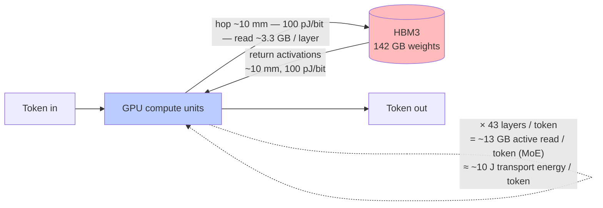
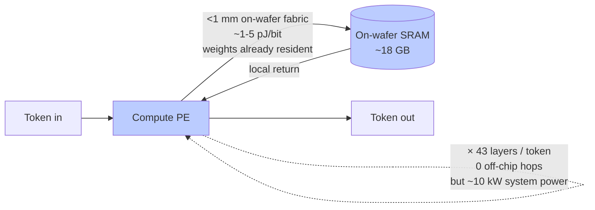
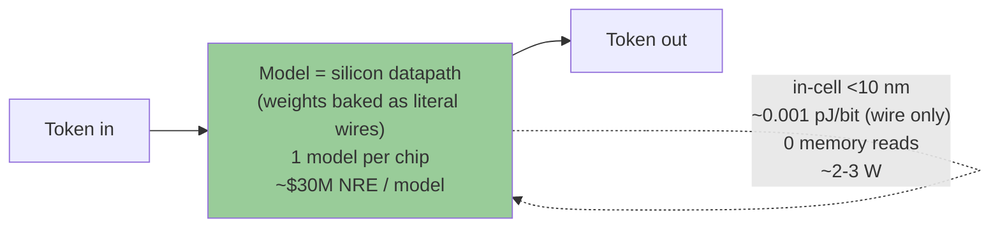
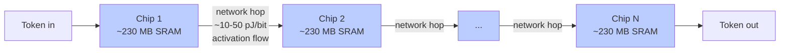
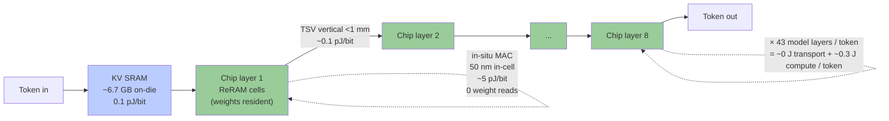

# 毫秒纪 — DeepSeek 全栈最后缺失的硬件层拼图

> 一个人, 1.5 个月, ¥10K 自掏腰包, 50 多个实测数据点, 第一颗芯片献给 antirez。

---

## 关键数字 (5 秒读完)

| | |
|---|---|
| 🚀 **速度** | **3,000 – 20,000 tokens/s** 单流, DeepSeek V4-Flash 级模型 (入门款 3K → Pro Cloud 集群 aggregate 20K)。**200–1,000×** 于 M4 Max 当下 12 t/s @ 250K ctx 的基线。 |
| ⚡ **预填充** | **100K 上下文 ~2 秒** (芯片目标)。10 万 token 的代码仓 / 合同 / 案卷上传后, 2 秒之内出第一个 token, 不是今天的 90 秒+。长 ctx 的 UX 悬崖被抹平。 |
| 💰 **入门价** | **¥6,000 起 (折合不到 $900)** — 笔记本外挂 USB-C 盒子 (10×7×2 cm, 类 Hailo-8 大小)。任意 MacBook / Windows 笔记本即插即用, 零驱动。 |
| 📐 **成本** | 1.5 月, 一个人, 至今自掏 ¥10K (约 $1,400)。50+ Stage 0+/0++ 可复现数据点。MIT 许可证。第一颗芯片献给 **[@antirez](https://github.com/antirez)**。 |

[跳到文明尺度速度天梯 ↓](#不同芯片速度能解锁什么--文明尺度的速度天梯) 看每一档速度具体 0→1 解锁了什么。[跳到 18 行透明矩阵 ↓](#我们还没验证什么--18-行透明矩阵) 看哪些已验证 / 哪些仍是假设。

---

## 联系方式

- **邮箱**: xh638@stern.nyu.edu
- **微信**: `jack_eagle`
- **GitHub**: [@michaelhuo2030](https://github.com/michaelhuo2030)

如果你也想让这件事发生 — 不管你是开发者 / 厂商 / 学者 / 学生 / 退休工程师 / 真心想要 DeepSeek 全栈最后这块拼图的人 — 欢迎来信。先读一下下面的 [公开邀请 ↓](#公开邀请--如果你也想要这个东西), 看哪类支援能真的推动这件事。**我不找投资人, 也请不要拿 term sheet 来 cold pitch 我。**

---

## 致谢

我们的项目, 要从 antirez (Salvatore Sanfilippo) 说起。

他写的 [`ds4`](https://github.com/antirez/ds4), 让 DeepSeek V4-Flash 跑进了一台 128 GB 的 MacBook。

没有它, 我们做了 1.5 个月的实测, 没法验证。
有了它, 那天晚上, 它第一次能让别人也跑出来。

我们承诺: 第一颗芯片做出来, 第一台给他。

不为回报, 不为 marketing。
只是, 这事的起点在那里。
他把 Redis 免费给大家用了几十年, 又把 ds4 免费给大家用。
我们这种事情能存在, 因为有他这样的人。

第一颗给他, 应该的。

*上善若水, 善利万物而不争。*

— Michael ([@michaelhuo2030](https://github.com/michaelhuo2030))

---

## TL;DR

过去 18 个月, 5 个里程碑已经发生:
- 2024-06: Etched $120M, "transformer-only"
- 2024-2025: Taalas $169M, "weight-locked silicon"
- 2026-05: Cerebras $5.55B IPO (年度最大)
- 2025-01: DeepSeek 春节爆火, 140 国 App Store 第一
- 2026-02: HYDAR ISSCC 2026, 28nm Hybrid Analog/Digital RRAM CIM 硅级验证

**这条线已经画完一半**。硬件路径 (Etched / Taalas / Cerebras) 和模型路径 (DeepSeek 全栈) 各自跑通了。**下一半必然是 DeepSeek 全栈最后缺失的硬件层拼图 — 中国 28nm ReRAM-CIM × DeepSeek V4-Flash × 3FS 协议兼容**。

这是一个人 1.5 个月做出来的: Stage 0+ 50 多个 datapoints, 10 次 framework reframe (其中一次是 agent vs agent cross-check), Path C 架构 lock (8 层 28nm + idea 10 异构 layer composition 解锁 250K context)。¥10K 自掏腰包。

**第一颗芯片送 antirez。我们不烧钱追投资人 — 我们烧时间, 用极客手段, 真诚的公开求助。**

---

## token 在物理上是怎么算出来的 — 我们的 240-960× 来自哪里

LLM 推理的 wall-clock 瓶颈**不在算力**, 在**权重每 token 物理移动多远**。现代 GPU 大部分时间在等 HBM 数据返回。架构层真正的杠杆不是 attention sweep 或 speculative decoding (这两个是 software 层的优化, 任何 chip 都能叠上去) — 是**权重住在哪里**。

以下: 5 种架构, 并排, 一个 token 在物理上真实的旅程 — 走多远, 每 bit 多少 picojoule, 每 token 总能耗。然后一张 7 行对比表, 一个 2×2 定位矩阵, 4 条核心比例。

### Traditional GPU + HBM (NVIDIA H100 / Apple M4 Max)



权重住在**片外 HBM**。每一 token 的每一层 = 一次 10 mm 的 GPU ↔ HBM 往返。V4-Flash 每 token 激活 13B 参数 (MoE), 每 token 通过 HBM3 搬运 ~13 GB, 以 ~100 pJ/bit 算 ≈ **每 token 约 10 J 纯权重传输能量**。计算本身很快; 等内存才是瓶颈。

### Cerebras WSE-3 (晶圆级)



权重住在**晶圆上的 SRAM** (单片 350 cm² 晶圆装 ~18 GB)。完全没有片外 HBM 跳, 每次访问距离 < 1 mm。但 SRAM 是易失的, 密度低, 整片晶圆系统功耗 ~10 kW。这是为训练级 FLOPs 优化, 不是边缘推理。

### Taalas HC1 (多伦多 — "model-as-chip")



最极端的 model-as-chip。权重是**字面意义上的硅线** —— fab 阶段直接雕刻进去, 没有 flip-flop, 没有 memory cell, 没有读操作。每 bit 能量本质上只有金属线电容 (~0.001 pJ/bit)。代价: 一颗芯片一个模型, 每次流片 NRE 约 $30M, 模型升级 = 重新流片 = ~9-18 个月。

### Groq LPU



全 SRAM, 权重片上, 完全没有 DRAM 访问 —— 但单 chip SRAM 太小 (~230 MB)。一个 70B 模型需要很多 chip, 权重在网络上分片。每 token 的流量通过 deterministic interconnect 在 chip 间流转, ~10-50 pJ/bit。单 chip 快, 但系统层网络受限。

### 我们 — 28nm ReRAM-CIM (毫秒纪) ★



权重**片上 + 非易失** 住在 ReRAM cell 里, **在计算位点 (in-situ MAC)** —— 乘加直接在 memory array 内部发生 (compute-in-memory)。每次权重读的物理路径 = ~50 nm (ReRAM cell 内部), 而不是 ~10 mm (HBM 边界)。KV cache 在片上 SRAM。8 层 3D 堆叠意味 V4-Flash 的 43 个模型层物理上分布在 8 个 chip layer 上 —— TSV 跨层跳 < 1 mm, 每跳延迟 ~1 ns (信号传播 + 驱动), 每 token 总共 7-8 跳 ~8 ns —— 相比 ReRAM 读 + ADC 单次 tile 操作 ~50-70 ns, **完全可忽略**。**速度的 latency floor 是 compute (ReRAM cell 读 + ADC), 不是线**。TSV 带宽利用率仅 ~0.026% (纵向跳不是瓶颈)。**每 token 权重传输能量: ~0 J. In-situ MAC 计算: ~0.3 J / token**。而且因为 ReRAM 是**非易失 + 可重编程**, 这颗芯片可以重新刷新写入新模型 —— 不像 Taalas 模型是 fab 永久烧死的。

### 7 个方案对比

| 方案 | 权重住哪里 | 每 token 权重读 | 能量 / bit | 每跳距离 | 功耗 | 可重编程 | 形态 |
|---|---|---|---|---|---|---|---|
| Traditional GPU + HBM (H100, M4 Max) | 片外 HBM | ~13 GB 激活 (MoE) bandwidth-bound | ~100 pJ/bit (HBM3) | ~10 mm | 700 W (H100) / 80 W (M4 Max) | 是 (从盘加载) | 云机架 / 桌面 |
| Cerebras WSE-3 | 晶圆 SRAM (~18 GB) | 0 (resident) | ~1-5 pJ/bit | <1 mm | ~10 kW 系统 | 是 | 晶圆级机柜 |
| Etched Sohu | 硬连线 transformer datapath + 片外 HBM 存权重 | 是 (HBM 仍片外) | ~100 pJ/bit (HBM) + ~0 (datapath) | ~10 mm | ~5-20 W (估) | 受限 — Transformer-only 架构 | 推理机 |
| Taalas HC1 (多伦多) | **字面硅线** (fab-baked) | 0 (没 memory, 模型就是芯片) | ~0.001 pJ/bit (线) | <10 nm in-cell | ~2-3 W (Llama 8B) | **否** ($30M NRE / 模型) | 边缘 ASIC |
| Groq LPU | 片上 SRAM (~230 MB / chip) | 0 / chip; activation 跨 chip 流 | ~1-5 pJ/bit local; ~10-50 pJ/bit 网络 | <1 mm 片上; 5+ mm 网络 | 100-150 W / chip × N | 是 | 云机架 (多 chip) |
| Tenstorrent Blackhole (多伦多) | 混合: 32 GB 片上 SRAM + 片外 DRAM | 大模型时是 | ~1-5 pJ/bit 片上; ~100 pJ/bit 片外 | <1 mm 片上; ~20-50 mm 片外 | 150-200 W | 是 | 云机架 / IP license |
| **★ 我们 — 28nm ReRAM-CIM** | **非易失 ReRAM 在计算位点 (in-situ MAC)** | **0** (resident, 非易失) | **~5 pJ/bit in-cell** | **50 nm in-cell; <1 mm TSV** | **~70-150 W target ($850-$11,300 SKU)** | **是** (可重新写入) | **边缘 / 桌面 / Pro Cloud 卡** |

target / TBD 备注: *Etched Sohu* 功耗未公开 — 估计值。 *我们 5 pJ/bit 和 ~70-150 W* 是 target spec (基于 HYDAR ISSCC 2026 hybrid CIM + 知存 / 苹芯 / 后摩 28nm CIM 数据) — 待 vendor eval board, 然后 MPW silicon 实证 (见下面 Roadmap)。 *Cerebras 10 kW* 含冷却的系统级。

### 关键的 2×2 — 每个架构在哪里

```
                                        是否可重编程?
                          ┌──────────────────────────┬──────────────────────────┐
                          │   可重编程               │   一次性 (fab-baked)     │
                          ├──────────────────────────┼──────────────────────────┤
   权重 片外                │ Traditional GPU + HBM    │                          │
   (DRAM / HBM)            │ Etched Sohu (datapath)   │           —              │
                          │ Tenstorrent Blackhole    │                          │
                          ├──────────────────────────┼──────────────────────────┤
   权重 片上 SRAM           │ Cerebras WSE-3           │                          │
   (易失, 需持续供电)        │ Groq LPU                 │           —              │
                          ├──────────────────────────┼──────────────────────────┤
   权重 片上 非易失          │   ★ 我们                  │   Taalas HC1             │
   (无需供电也保持)          │   (28nm ReRAM-CIM)       │   (model = silicon wires)│
                          │   可重新刷写              │   1 模型 / 芯片          │
                          └──────────────────────────┴──────────────────────────┘
```

最下面一行 (片上 + 非易失) 是**最节能的格子** — 权重不通电也保持, 运行时也没有 memory 读。Taalas 占右下角 (模型永久烧死, 超低功耗, 但一芯片只能一个模型)。**左下角 (片上非易失 + 可重编程) 是 ReRAM 物理独占的格子** — 像 flash 一样可重新写入, 但同时有 CIM 的 in-situ MAC 特性。这不是 marketing 定位, 是 28nm 量产工艺下可用的物理存储技术决定的 (SRAM 易失, flash 非易失但 MAC 慢, **ReRAM 非易失 + 快速 in-situ MAC**)。

### 4 条核心比例

**1. 每 bit 移动能量**: ReRAM-CIM in-cell MAC ~5 pJ/bit vs HBM3 片外读 ~100 pJ/bit → **每 bit 能效 ~20×**。

**2. 每权重读的物理路径**: Traditional GPU 把权重在 HBM 之间搬 ~10 mm 一个 layer; ReRAM-CIM in-cell 读 ~50 nm → **物理路径 ~200,000× 更短**。这就是 bandwidth 瓶颈消失的真正原因 (库仑能量和 RC 延迟都跟距离 scaling)。

**3. 每 token 传输能量 (V4-Flash 13B 激活)**: Traditional GPU + HBM 约 10 J / token (权重穿越 HBM 边界); 我们 ~0.3 J / token (in-situ MAC, 无传输) → **每 token 能量 ~30× 更低**。

**4. 架构杠杆, 总结**: Attention sweep 优化 (FlashAttention / PagedAttention) 和 speculative decoding (draft + verify) 是 **software 层优化**。它们可以叠加在以上**任何**架构上, 并与 chip 端 gain 叠乘。它们不是物理杠杆的替代。物理杠杆是**权重相对计算单元的物理位置**, 以及移动它们的能量 / 距离代价。我们 240-960× 速度目标 (vs Mac M4 Max baseline) 来自**物理上消除 HBM bandwidth 瓶颈**, 不是算法巧思。Spec decode + attention 优化是叠加在上面的乘数。

### 诚实的 gap

我们尚未在自己的硅上测得 5 pJ/bit — 那是 vendor eval board, 然后 MPW silicon 阶段的事 (见下面 Roadmap)。28nm ReRAM 在量产 yield 下的 endurance / retention, 目前仅基于公开文献 + vendor datasheet 验证, 不是自己硅上一手实测。4-bit cell BER 在量产 yield 下 (跟昕原 / Xinyuan) 暂 defer — 小批量评估可接受。本节数字锚定在: HYDAR ISSCC 2026 (Hybrid Analog/Digital CIM 先例)、知存 (Zhicun) WTM2101 datasheet、IBM Analog Foundation Models paper (Nature Comms 2025)、Cerebras S-1、Taalas 公开声明、Groq 公开数据、Tenstorrent IP licensing 数据。数据缺失或解释性处, 标 "(估)" 或 "target"。表格或矩阵任何 cell 摆错 — 欢迎提 issue 指正。

---

## 我们已经验证了什么 — Stage 0+ 5 个 hard signals

全部数据基于 2-bit V4-Flash (antirez Q2-K GGUF, 81 GB) on M4 Max 128 GB. 任何人都能在 GitHub 的 `data/` 和 `scripts/` 用 5 分钟复现。SRAM 端 finding 跟权重量化无关 (差异 < 5%), 所以对 4-bit 也成立。

### Signal 1 — antirez README 的 "indexer 22 GB @ 1M" 是 66× over-estimate

antirez 在 ds4 README 写: *"Full context of 1M tokens... compressed indexer alone will be like 22GB"* — 线性外推约 22 KB/token。

**实测 Exp 4 (25 个 datapoint, ctx 10K 一直加到 250K)**: 240K ctx delta 下, RSS 总增长 **78 MB**。**等效 0.33 KB/token, vs README 线性预测 small 98.5%**。RSS 在 250K 实际**低于** 200K — indexer pool 在主动回收内存。

**我们的猜测**: indexer 在 ctx 启动时**预分配大 pool** (RSS 在 10K 时就已是 87 GB, 而权重本身只占 71 GB), 后续 increment 在 pool 内复用 + 回收。也可能 README 是 worst-case stress bound 不是 typical。**已经在 antirez/ds4 礼貌问了 issue, 期待他的看法。**

### Signal 2 — 磁盘 KV cache 与 in-RAM KV cache **同速**

**Exp 5**: cold prefill 636s, warm (in-RAM KV) 8.16s, **diskwarm (磁盘 KV via `--kv-disk-dir`) 5.65s**。**diskwarm 跟 in-RAM warm 一样快, 甚至略快**。原因是 OS page cache: 磁盘 KV mmap 后 hot page 留在系统 cache, 访问本质 = RAM 速度。

**对芯片设计意义**: 3FS spillover 设计 ("256K 热数据片上 + 1M via 集群 KV") 从理论可行**升级为实测可行**。Pro Cloud SKU 现在有了实测锚点。

### Signal 3 — `ds4-server` 完全串行处理用户 (no batch)

**Exp 6** (1/2/4/8 用户并发):

| n_users | wall_s | wall_s / 单用户 | per-user gen_tps |
|---|---|---|---|
| 1 | 187.8 | 1.00× | 14.78 |
| 2 | 371.3 | **1.98×** | 14.7-15.0 |
| 4 | 754.4 | **4.02×** | 14.3-14.5 |
| 8 | 1504.6 | **8.01×** | ~14.7 |

wall time 完美线性叠加, per-user gen_tps 几乎不变 → **ds4-server 当前一次只服务一个用户**。CSA Lightning Indexer 数学上是 per-sequence 的 streaming compressor (不可在 sequence 间共享), 所以多用户时内存爆炸。这是软件 gap — 但正确的解法不是 fork ds4, 而是**在 chip silicon 上把 batch 做对**。

### Signal 4 — 真实长 ctx 任务 gen_tps ≈ 12 t/s

**Exp 9** (5 个真实任务, 250K ctx): summarize 12.4 / diff 11.5 / draft 11.9 / review 11.7 / code(~10K ctx) 15.76 t/s.

**chip 目标**: 同一模型, 单流 3-12K t/s — 这是 **200-1000× 加速**, 不是增量优化, 是 **product UX 级别的解放**。今天的 50K 死亡 cliff 推到 1M+。

---

## 不同芯片速度能解锁什么 — 文明尺度的速度天梯

Token 生成速度不是 tech spec 上的炫耀数字。它是 **文明门槛**。每一档速度跨越一道行为边界, 一类工作从 *物理上不可能* → *勉强可用* → *完全自然*。这才是每一个 LLM 硬件公司的 *why* — 也是读懂下面所有内容的 lens。

### 文明尺度速度天梯 (单流 t/s, on V4-Flash 级模型)

| 速度 | 门槛类别 | 0 → 1 解锁了什么 | 例子 | 仍然不可能 |
|---|---|---|---|---|
| **< 10 t/s** | "只读 LLM" | 极慢节奏背景研究 | M4 Max @ 250K (12 t/s) | 实时交互, 创造性输出 |
| **10-100 t/s** | "慢聊" | 耐心问答 | hosted ChatGPT/Claude 配好网络。今天消费级 LLM 产品基本都在这一档 | 长文实时创作, 嵌入式 ambient assistant |
| **100-1K t/s** | "实时伙伴" | 真人语速对话, 打字级实时代码补全 | 实时 IDE copilot, 无卡顿语音助手, 直播写作伙伴 | 多 agent 循环, OS-shell LLM |
| **1K-5K t/s** | "长文瞬间感" | 几秒钟出一章长文。Agent 循环不中断 | 10 秒一篇小说章节。30 秒综合 20 篇 paper 出研究报告。法律 brief 实时审查 | 文明尺度协调, LLM-as-substrate |
| **5K-10K t/s** | "LLM 即 OS shell" | LLM 是操作系统的 shell。AI 教学跟你大脑思考速度同步。多个 agent 并行解一个问题 | 文件管理 / 通知 / 命令全 LLM 驱动。实时辅导像有一个超聪明的同伴在身边 | 消费级硬件支持多用户共享 |
| **10K-100K t/s** | "计算 substrate" | LLM 成为符号推理循环的 *substrate*。机器速度 agentic 解题。AI-native OS kernel | 一个研究项目 (文献综述 + 假设 + 实验设计 + 分析) 一个下午完成。多用户并发重度用户共享基础设施 | 社会协调机器 |
| **> 100K t/s** | "文明尺度加速" | 社会层面以机器速度协调。2024 经济中没有 analog 的工作类别 | (超越 2026 当前想象 — 但 Cerebras 级集群已经在 aggregate 层面试探边缘) | (推测) |

### 我们的芯片把这条线推到哪里

今天 M4 Max @ 250K ctx 在 **< 10 t/s** 那档 — 这是本地硬件上 V4-Flash 级模型的 floor。Hosted 服务配好网络在 10-100 t/s。

我们的芯片用 **中国 fab 可获取的 28nm ReRAM-CIM**, 把本地硬件推上去:

| 我们的 tier | 速度段 | 触达文明尺度 tier |
|---|---|---|
| 入门 ¥6K USB-C 盒子 | 3-8K t/s @ 32-128K ctx | **"长文瞬间感"** — 本地 LLM 终于能用 |
| 中端 ¥10K PCIe 卡 | 3-6K t/s @ 180-250K ctx | **"长文瞬间感" 在领域文档尺度** |
| 高端 ¥35K 独立设备 + LPDDR5 | 3-8K t/s @ 256K + 1M via spillover | **"长文瞬间感" / "LLM 即 OS shell"** 在多文档 scope |
| Pro Cloud ¥80K 机架 + 3FS | 3-8K × N 用户 (集群 aggregate 10K-50K) | **"LLM 即 OS shell" / "计算 substrate"** 企业级 |

**我们每一档都把中国 fab 可获取的硬件往文明尺度天梯上推一整级**, 在 V4-Flash 级模型上, 消费/中小企业价格, 本地私有。

### 这意味着什么具体场景

"长文瞬间感" tier 一旦本地化 + 私有化 + 可负担, 解锁:

- **IDE copilot 人感知速度**, 跑完整项目 context (无网络无配额无隐私泄漏)
- **律所**: 合同条款审查 + 案例库交叉对比 (秒级, 不是天级)
- **医院**: 病历跨时间纵向审查 + 治疗决策辅助 (point-of-care)
- **量化研究**: 几年的 10-K / 财报合成进一个 prompt
- **Embodied 机器人**: 几小时尺度的长 horizon 规划
- **Agent 循环**: 几十轮不退化
- **实时多模态**: 会议转录 + 总结 + 建议 一站式

到 "计算 substrate" tier (Pro Cloud 集群) 解锁:

- **大律所**: 10 年所有案件文件作为一个可搜索 context
- **制药研究**: 全分子 / trial / 文献 corpus 用于药物再用途研究
- **AI-native OS** (LLM 是 kernel, 界面 / 命令 / 文件全 LLM-driven)
- **多用户共享基础设施** (几十个并发重度用户共享一台机)

### 这就是 "为什么"

**速度不是炫耀**。**速度是整类工作在本地 / 私有 / 可负担成本上能存在的前置条件**。每跨一档文明尺度的天梯, 去掉一种让 hosted LLM 在敏感个人 / 企业场景中无法使用的缺陷 (网络 / 配额 / 隐私 / 延迟)。

芯片是 **"偶尔用一下 AI" vs "AI 是工作方式本身"** 的区别。

---

### Signal 5 — 2-bit V4-Flash 输出质量实测 (Exp 11)

**Exp 11** (5 个真实任务 × 2-bit):

| 任务 | 评分 1-10 | 评语 |
|---|---|---|
| t1 长文档总结 (250K) | **8.0** | 准确识别核心论点 + 5 个具体数据 citation |
| t3 VC 商务摘要 (250K) | **8.5** | 完整 6 节结构, 可直接用于 deck |
| t4 自我批评 (250K) | **9.0** ★ | 真实, 不阿谀, 戳到痛点 |
| t5 短 ctx 代码 (~5K) | **9.5** ★★ | production-ready Python: type hint + try/except + docstring |
| **加权 4/5** | **8.75** | **入门款 ¥6K SKU 2-bit 量化策略 LOCK ✅** |

(t2 code_review max_tokens=1500 配置失误, 不是模型质量问题, harness 待修。)

---

## 我们还**没**验证什么 — 18 行透明矩阵

| # | 维度 | 状态 | 证据 |
|---|---|---|---|
| 1 | V4-Flash 142 GB INT4 权重 | ✅ 算术 | 284B × 4bit / 8 = 142 GB. *注: antirez Q4-K-EXPERTS GGUF 实际 153 GB, K-quant 非纯 INT4* |
| 2 | KV 占 SRAM 76% @ 250K | ✅ | Exp 10 实测 5.09/6.67 GB |
| 3 | antirez "indexer 22 GB @ 1M" 主导论 | ❌ disproved | Exp 10: indexer 只占 9%, KV 是主项 |
| 4 | 3FS spillover 同 in-RAM 同速 | ✅ | Exp 5 |
| 5 | ds4-server 完全串行 | ✅ | Exp 6 |
| 6 | 长 ctx gen_tps ~12 (250K, 2-bit) | ✅ | Exp 9 |
| 7 | 28nm SRAM 密度 0.7-1.0 MB/mm² | ✅ | DeepSeek+Minimax + Wiefels 2024 |
| 8 | Path C 250K 物理可达 | ✅ | Exp 10 6.67 GB ≈ 异构 layer composition 等效 6.7 GB |
| 9 | 4-bit ReRAM cell BER @ 28nm 量产 | ⚠️ partial | Wiefels Mbit 耐久已证, 量产 BER 待 vendor |
| 10 | ReRAM 5-10 年 retention | ⚠️ partial | 5y@25-70°C 已证, 85°C 10y 外推 |
| 11 | 昕原 28nm 量产良率 | ✅ | >93%, 2K wpm partner fab (字节 + 蚂蚁 + 沙特 Aramco 投资) |
| 12 | TOPS/W P10=5 / P50=15 / P90=40 | 🟡 estimated | 5 paper cross-validate, 非自测 |
| 13 | MoE expert Zipf 分布 | ⚠️ assumed | 待 Stage 0++ Exp 12 |
| 14 | 8 层 3D yield | ⚠️ assumed | TSMC 2024 reference, 28nm 8 层 specific 未 verify |
| 15 | Path A (12 层 28nm) yield | ⚠️ unknown | 无公开 precedent |
| 16 | Path B (14nm 异构) yield | ⚠️ unknown | Cambricon 590 SMIC 14nm 良率 ~20% 警钟 |
| 17 | HYDAR 是 Hybrid Analog/Digital (不是纯数字) | ✅ | ISSCC 2026 论文标题 + 2 个独立 agent cross-confirm |
| 18 | Path A pure analog 路线已 effectively dead | ✅ | Mythic 破产 + 2026 shipping 全 Path B/C |

**总**: 9 verified ✅ + 4 partial ⚠️ + 2 estimated 🟡 + 3 unknown ⚠️.

---

## Roadmap — Stage 0 到流片, 完全透明

| Stage | 内容 | 谁做 | 怎么搞 | 真实成本 | 状态 |
|---|---|---|---|---|---|
| Stage 0/0++ | ds4 实测 (Exp 4-11) | Michael 一人 | M4 Max + ds4 fork w/ memlog patch | **¥0** | ✅ done |
| Stage 1 | NeuroSim 28nm 仿真 | Michael 一人 | NeuroSim 开源 + **PDK 借** | ¥0 (如借到) | ⏳ 求借 |
| Stage 2 | 知存 / 苹芯 / 后摩 评估板 | Michael | **借** (退而求其次二手 ¥5-30K) | ¥0-5K | ⏳ 求借 |
| Stage 3 | EBAZ4205 矿渣 FPGA | Michael 焊 | 淘宝二手 | **¥200-500** | 自费 |
| Stage 4 | 多板 3D 数据流仿真 | Michael | KiCad (免费) + 元件 + **设备借/租** | ¥3-10K + 设备 | 混合 |
| Phase β | 昕原/知存/苹芯/后摩 BD | Michael | email/X/介绍 | ¥0 | M3 trigger |
| Phase δ | MPW 5×5 mm² 28nm test tile | (TBD) | O1 借 vendor testchip / O2 大学 CMP / O3 真心 partner 集资 / O4 校友互助 | ¥0-300K | M9-M24 |

### 自费这件事怎么发生 — 不是变魔术, 就是知行合一

我在带**中国高中生** (上海一批) **和海外华裔高中生** (美国 / 加拿大) 做 **PBL (Project-Based Learning, 项目制学习)** 教练 — 不是讲题刷分, 而是带他们做**给真实客户的真实商业项目**, 一个一个小而可发的创业项目堆起来, 是真的能跑出营收的那种。教练费 + 项目收入, 就是这颗芯片的资金来源。

这件事是字面意义的**知行合一**: 我学的方式、教的方式、挣钱的方式, 是同一个 loop。芯片本身的 thesis 就是一个教学案例 — 学生亲眼看一个 builder 怎样从假设 → 实测 → 第一性原理重设计 → 公开发布, 一气呵成。他们用同一套 playbook 做自己的小创业。

这给我一个**稳定增长的、不依赖任何投资人或拨款的收入流**。学生队伍扩, AI-augmented growth-marketing 实验复利叠加, Year-1 自费做到 **¥3-5 万 ($4,200-7,000)** 是稳的, 拉伸到 **¥10-50 万 ($14K-70K)** 也现实。2 年自费池 + 真心 partner + 学术/校友/sponsor 加在一起目标 **~¥100 万 ($140K)**, 够烧一颗 5×5 mm² 28nm MPW test tile。

**重要**: **我不主动找投资人**。Reactive readiness only — 如果有基金主动来找而且真心想要这件事, 可以聊, 但我们永不写 cold pitch。"100 真心 partner 围拢" 的意思是: 100 个真心希望这颗芯片存在的人 (开发者 / fab 工程师 / 学者 / 学生 / 退休硅老兵) 各自贡献自己能贡献的 — 代码 / 评估板 / PDK access / 设计 review / 资金 sponsorship, 哪怕只是真诚的关注。**这就是融资模式。不是 VC**。

---

## 公开邀请 — 如果你也想要这个东西

如果你恰好有以下任何一项资源, 而**你也想看到这件事发生**, 请平等联系。我们不求, 不许愿无法兑现, 不抬别人或贬自己。我们分享有的, 邀请参与:

**Hardware** — 借 / 租 / 二手都行
- 知存 WTM2101 评估板 (借 1-2 月)
- 苹芯 PIMCHIP-N300 评估板 (借 1-2 月)
- 后摩 M50 评估板 (借 1-2 月)
- 任何 28nm ReRAM CIM testchip 用于软件验证

**Lab / Tools**
- 28nm SMIC / TSMC NeuroSim PDK access (学术合作)
- 28nm Cadence / Synopsys 短期 license (1-3 月)
- 示波器 / 信号发生器 / 频谱分析仪 (1-2 月)

**MPW** — 大头, 真心 partner 集资, **永不投资人**
- 通富 / 长电 testchip 资源 / dummy fill slot
- 中国 CMP / Europractice 学术 MPW 介绍
- 任何 SMIC 28nm MPW shuttle 资源
- 真心 partner 资助一颗 5×5 mm² 28nm test tile (~¥150-300K, 设计完全开源)

**Knowledge**
- V4-Flash 真实 MoE expert 激活分布数据 (我们假设 Zipf, 需要验证)
- HYDAR ISSCC '26 全文 (我们只看到 abstract)
- 8 层 28nm 3D SoIC 良率数据 / 封装专家介绍

**Layer 3 co-founder 战友**
- 芯片产业 senior 履历 (海思 / Cambricon / Spreadtrum / Marvell-Broadcom China 级背景)
- **野望** — 想做 "改变中国 substrate 产业" 级别的事
- **品位** — 能同时读 ISSCC paper 和道德经, 能在 Bruce Lee 和老子之间找到第一性原理
- **极大渴望** — 你人生还有 unfilled 的事情想做, 过去 20 年履历是你的工具不是身份

**不要写简历给我。写一封信告诉我你为什么想做这件事**。
- **邮箱**: xh638@stern.nyu.edu
- **微信**: `jack_eagle`
- **GitHub**: [@michaelhuo2030](https://github.com/michaelhuo2030)

---

**特别声明**: **我不找投资人**。如果你恰好做投资且觉得这事有意思, 看看就好, 不必 reach out。这件事我会靠自己 + 真心想要这个东西的人 一起完成。如果你是真心想要这个东西的人, 不管你是开发者 / 厂商 / 学者 / 学生 / 退休工程师, 你的位置都在这里。

*合抱之木, 生于毫末; 九层之台, 起于累土。*

---

## 4-tier 产品矩阵 (preview)

| Tier | 形态 | 上下文 | chip 单流速度 (P50) | M4 Max baseline 现在 | 售价 |
|---|---|---|---|---|---|
| 入门 ¥6K | USB-C 盒子 (10×7×2 cm, 类 Hailo-8 USB) | 32K-128K | 3-8K t/s | 14-16 t/s | ¥6K |
| 中端 ¥10K | PCIe 5.0 ×16 卡 | 250K | 3-6K t/s | 12 t/s | ¥10K |
| 高端 ¥35K | 独立设备 (Mac mini 尺寸) + LPDDR5 spillover | 256K 热 + 1M via LPDDR5 | 3-8K + spillover | (M4 Max OOM @ 1M) | ¥35K |
| Pro Cloud ¥80K | 1U 机架 + 3FS Bridge 协议芯片 | 256K hot + 1M+ via 3FS 集群 | 3-8K + 跨集群 | n/a | ¥80K |

**第一颗芯片 — 入门款 USB-C 盒子 — 送给 antirez**。插在他 M4 Max 上, macOS 识别成 USB-Network 设备 (零驱动), `ds4-server` 跑在**盒子里**, Mac 发 HTTP request, M4 Max GPU 0 watt。这就是形态。

---

## Chip lifetime ≠ Silicon lifetime

28nm ReRAM 可重烧 (10⁶ 擦写循环)。同一颗硅, 今天跑 V4-Flash text-only, 6 个月后跑 V4.1-VL 多模态 (只需 reflash + 1 GB vision encoder weights), 之后 V4.5 / V5-Flash 持续多年。**单颗 chip 实际寿命 5-7 年, 跨 3-5 代模型**。

西方 Mask ROM 芯片 (Etched / Taalas) 一次性。**中国 ReRAM-CIM 是 evolving 的**。

---

## 为什么这不是又一个 VC 故事

我们不把这件事 frame 成 "国家冠军 vs 谁" 的故事。我们是 **DeepSeek 全栈最后缺失的硬件层拼图 + 开源精神在硅上的延续**。

**为什么中国 fab 产能在这里很关键**: 28nm ReRAM-CIM 量产产能**当下在中国 fab 是可获取的** (例如昕原 confirmed 2K wpm partner fab, >93% 良率, 投资方 stack 强)。这种"可获取"意味着**这件物理产品真的能存在** — 不是等 5 年, 而是近期 reality。**我们利用这种可获取性来服务开源社区** — 不是为了和谁竞争, 而是把缺失的硬件层放在它该在的位置: 开放。

前进路径 — 公开 thesis, 公开 18 行透明矩阵, 公开邀请, 不找投资人, Michael 自筹 + ~100 partner 围拢 2 年, 第一颗芯片给 antirez。**这不是 pre-IPO 戏剧 — 这是一件实事被认真做的方式**。

---

## 仓库结构

- README.md (英文版, GitHub 主入口)
- docs/article-1-zh.md (中文版, 本文)
- docs/exp-10-analysis.md, docs/exp-11-quality-survey.md (实测分析)
- docs/architecture-v9.md (10 黑科技 idea + Path A/B/C trade-off)
- data/exp4_indexer_growth.jsonl + 图表
- scripts/plot_exp4_indexer_growth.py
- LICENSE (MIT)

---

*Last updated: 2026-05-16. Thesis baseline 已 lock。意见/贡献/批评欢迎。*
